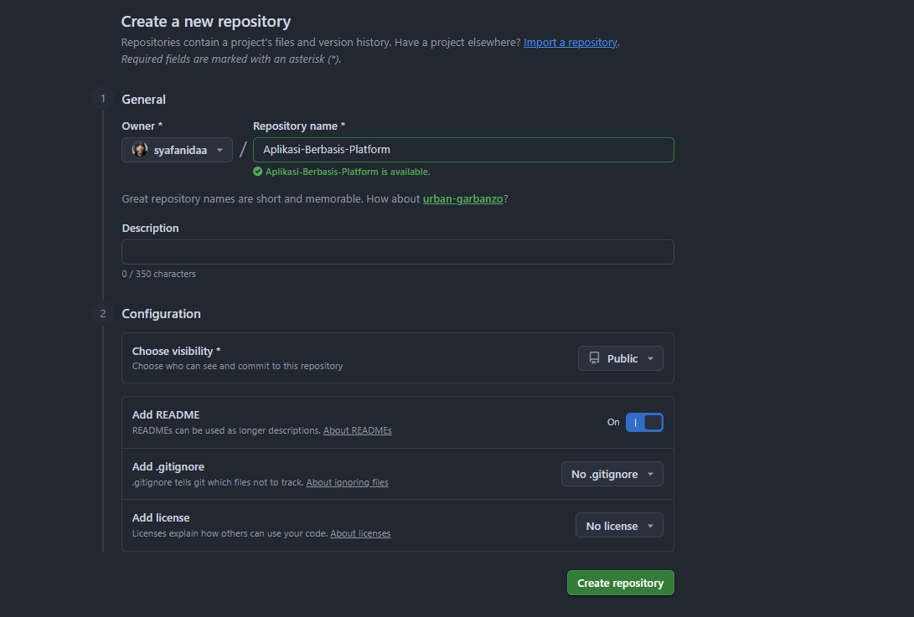
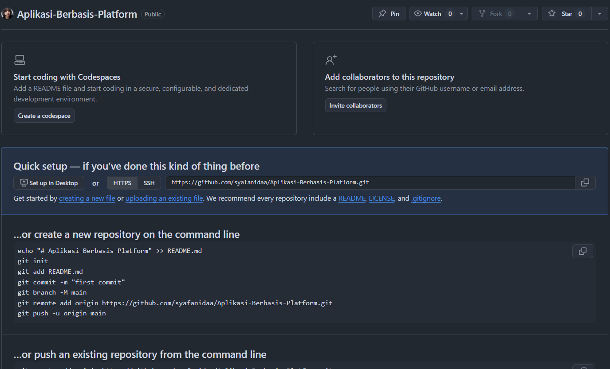
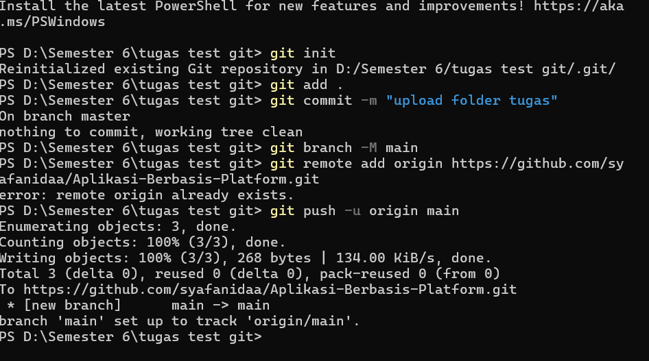
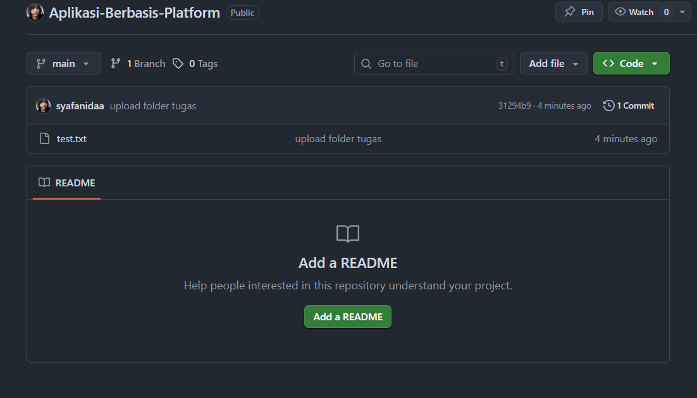

   
  <h1>LAPORAN PRAKTIKUM  APLIKASI BERBASIS PLATFORM</h1>
   
  <h2>MODUL 1  GIT</h2>
   
   
   
   
   
   
  <h3>Disusun Oleh :</h3>
  

    <strong>Syafanida Khakiki</strong> 
    <strong>2311102149</strong> 
    <strong>S1 IF-11-REG 01</strong>
  

   
  <h3>Dosen Pengampu :</h3>
  

    <strong>Dimas Fanny Hebrasianto Permadi, S.ST., M.Kom</strong>
  

   
   
    <h4>Asisten Praktikum :</h4>
    <strong> Apri Pandu Wicaksono </strong>  
    <strong>Rangga Pradarrell Fathi</strong>
   
  <h2>LABORATORIUM HIGH PERFORMANCE
  FAKULTAS INFORMATIKA  UNIVERSITAS TELKOM PURWOKERTO  2026</h2>

---

# 1. Dasar Teori

Git adalah sebuah **sistem pengontrol versi (Version Control System)** yang digunakan untuk mencatat perubahan pada file dalam suatu proyek. Dengan Git, setiap perubahan yang dilakukan dapat disimpan sehingga riwayat pengembangan proyek dapat dilihat kembali.

Git sangat membantu dalam pengembangan perangkat lunak karena memudahkan pengelolaan versi kode, mendukung kolaborasi tim, serta memungkinkan pengembang kembali ke versi sebelumnya apabila terjadi kesalahan.

Salah satu keunggulan Git adalah sistemnya yang **terdistribusi**, dimana setiap pengguna memiliki salinan repository lengkap pada komputer masing-masing. Hal ini membuat proses pengembangan tetap dapat dilakukan secara lokal tanpa selalu terhubung ke internet.

---

# 2. Setup Repository Menggunakan CLI

Pada praktikum ini dilakukan proses pembuatan repository pada GitHub serta menghubungkannya dengan folder proyek di komputer menggunakan **Command Line Interface (CLI)**.

---

## Langkah 1 : Membuat Repository di GitHub

Langkah pertama adalah membuat repository baru pada GitHub sebagai tempat penyimpanan proyek secara online.

---

## Langkah 2 : Repository Siap Digunakan

Setelah repository berhasil dibuat, GitHub akan menampilkan halaman repository yang masih kosong dan siap untuk diisi dengan file dari komputer lokal.

---

## Langkah 3 : Upload File Menggunakan CLI / CMD

Selanjutnya buka terminal atau Command Prompt pada folder proyek, kemudian jalankan beberapa perintah Git seperti `git init`, `git add`, `git commit`, dan `git push` untuk mengirimkan file dari komputer lokal ke repository GitHub.

---

## Langkah 4 : File Berhasil Terupload

Jika proses upload berhasil, maka file dari komputer lokal akan muncul pada repository GitHub. Hal ini menunjukkan bahwa repository lokal sudah berhasil terhubung dengan repository online.

---
