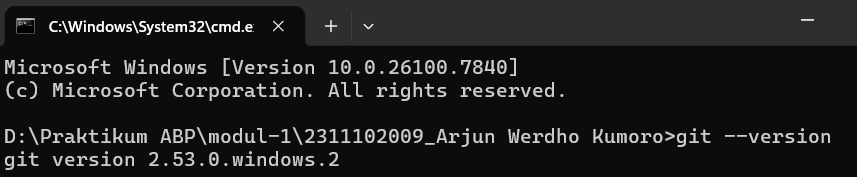
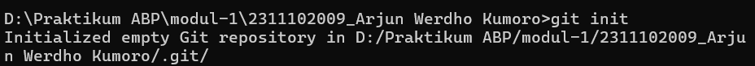
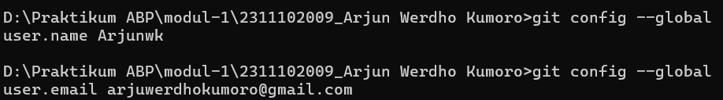
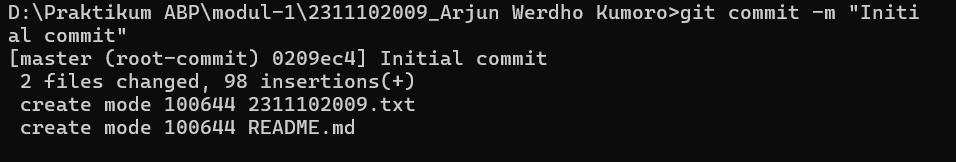
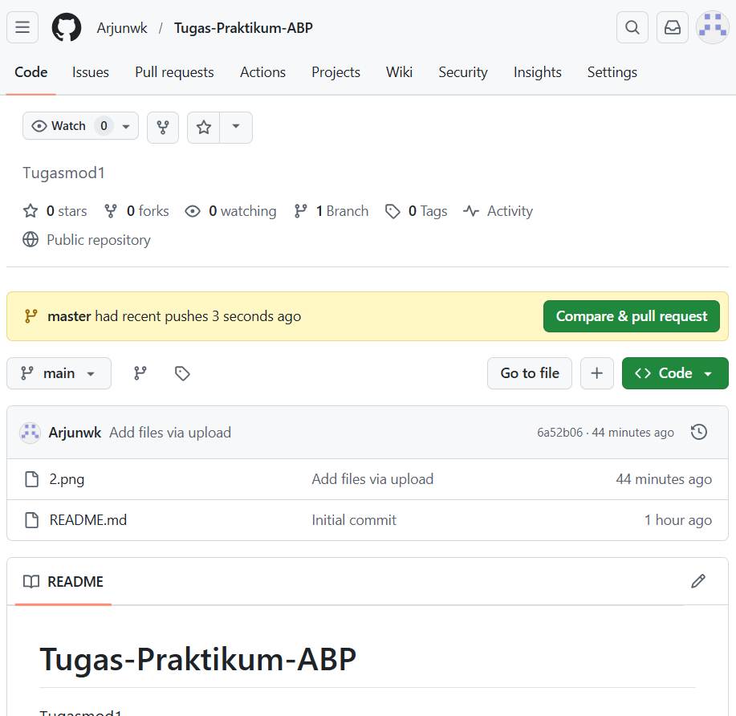
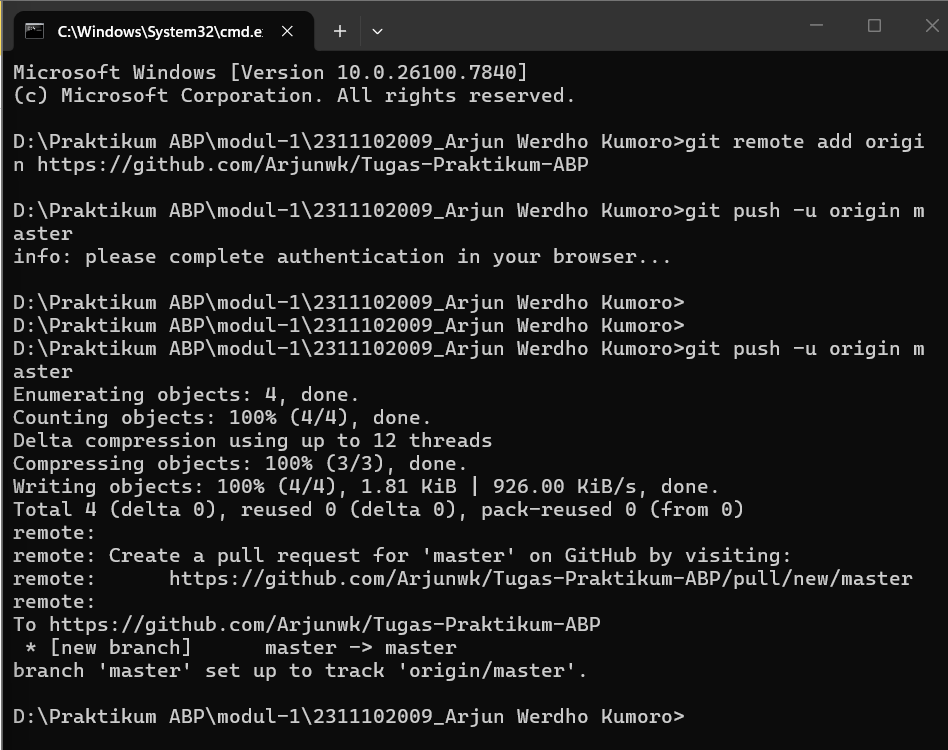

   
  <h1>LAPORAN PRAKTIKUM  APLIKASI BERBASIS PLATFORM</h1>
   
  <h3>MODUL 1   GIT</h3>
   
   
   
   
   
  <h3>Disusun Oleh :</h3>
  

    <strong>Arjun Werdho Kumoro</strong> 
    <strong>2311102009</strong> 
    <strong>IF-11-REG01</strong>
  

   
  <h3>Dosen Pengampu :</h3>
  

    <strong>Dimas Fanny Hebrasianto Permadi, S.ST., M.Kom</strong>
  

   
   
    <h4>Asisten Praktikum :</h4>
    <strong> Apri Pandu Wicaksono </strong>  
    <strong>Rangga Pradarrell Fathi</strong>
   
  <h3>LABORATORIUM HIGH PERFORMANCE
  FAKULTAS INFORMATIKA  UNIVERSITAS TELKOM PURWOKERTO  2026</h3>

---

### DASAR TEORI :

Git merupakan salah satu sistem pengendali versi (Version Control System / VCS) yang digunakan dalam pengembangan perangkat lunak dan dibuat oleh Linus Torvalds. Sistem ini berfungsi untuk merekam serta melacak setiap perubahan yang terjadi pada file atau kode dalam suatu proyek, baik yang dikerjakan secara individu maupun oleh tim.

Selain itu, Git termasuk jenis distributed version control system, yang berarti seluruh riwayat dan database proyek tidak hanya tersimpan pada satu server pusat, tetapi juga tersalin pada setiap komputer pengembang yang menggunakan repositori tersebut. Dengan sistem ini, kolaborasi menjadi lebih mudah dan risiko kehilangan data dapat diminimalkan.

### UNGUIDED :

**1. Installasi Git**
   
Cek apakah Git sudah terinstall atau belum, gunakan perintah berikut pada terminal: git --version

**2. Inisialisasi Repository Git**

Selanjutnya adalah melakukan inisialisasi repository Git pada folder project menggunakan perintah: git init

**3. Menambahkan File ke Staging Area**
Setelah repository dibuat, langkah selanjutnya adalah menambahkan file ke staging area.
Jika ingin menambahkan semua file yang ada pada folder, gunakan perintah: git add .
Jika hanya ingin menambahkan file tertentu saja, gunakan: git add namafile

masukan email dan username pada github fungsinya untuk menyambungkan antara cmd dengan github

**4. Melakukan Commit**

Setelah file berhasil ditambahkan ke staging area, langkah berikutnya adalah melakukan commit untuk menyimpan perubahan pada repository lokal. commandnya : git commit -m "Initial commit"

Commit digunakan untuk mencatat perubahan yang telah dilakukan pada project.

**5. Membuat Repository di GitHub**
Selanjutnya membuat repository baru di GitHub dengan cara:

- Login ke akun GitHub

- Klik New Repository

- Isi nama repository dan deskripsi sesuai kebutuhan

**6. Menghubungkan Repository Lokal dengan GitHub**
Setelah repository GitHub dibuat, hubungkan repository lokal dengan repository GitHub menggunakan perintah: git remote add origin https://github.com/Arjunwk/Tugas-Praktikum-ABP

**7. Mengirim File ke GitHub**
Langkah terakhir adalah mengirimkan file dari repository lokal ke repository GitHub menggunakan perintah: git push -u origin master

Perintah ini akan mengupload seluruh commit yang ada di repository lokal ke repository GitHub.

