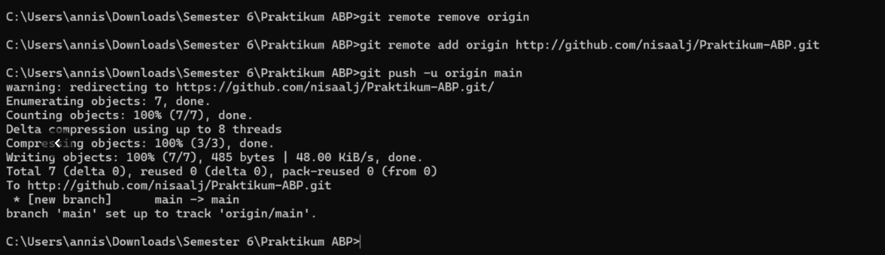

<div align="center">

# LAPORAN PRAKTIKUM
# APLIKASI BERBASIS PLATFORM

---

## MODUL 1
## SETUP REPOSITORY VIA CLI

---


---

**Disusun Oleh :**

**ANNISA AL JAUHAR**

**2311102014**

**S1 IF-11-REG01**

---

**Dosen Pengampu :**

Dimas Fanny Hebrasianto Permadi, S.ST., M.Kom

---

**PROGRAM STUDI S1 INFORMATIKA**

**FAKULTAS INFORMATIKA**

**UNIVERSITAS TELKOM PURWOKERTO**

**2025/2026**

</div>

---

## 1. Dasar Teori

**Git** adalah sistem pengontrol versi (Version Control System) terdistribusi yang digunakan untuk melacak perubahan pada file dan memudahkan kolaborasi dalam pengembangan perangkat lunak.

**GitHub** adalah platform layanan hosting berbasis web untuk repositori Git yang memungkinkan pengguna menyimpan proyek secara online dan berkolaborasi dengan orang lain.

**Command Line Interface (CLI)** adalah antarmuka berbasis teks di mana pengguna dapat mengetikkan perintah langsung untuk berinteraksi dengan sistem komputer. Dalam praktikum ini menggunakan Command Prompt (CMD) di Windows.

---

## 2. Setup Repository via CLI

### 2.1 Inisialisasi Repository Lokal
Pertama buka CMD dan masuk ke folder project, lalu jalankan perintah berikut untuk menginisialisasi repository git di lokal.
```bash
git init
```

### 2.2 Menghubungkan ke Repository GitHub
Hubungkan repository lokal ke repository yang sudah dibuat di GitHub.
```bash
git remote add origin https://github.com/nisaalj/Praktikum-ABP.git
```

### 2.3 Membuat Folder Modul 1 sampai 5
Buat folder untuk setiap modul langsung melalui CMD.
```bash
mkdir "Modul 1" "Modul 2" "Modul 3" "Modul 4" "Modul 5"
```

### 2.4 Upload ke GitHub
Lakukan commit dan push semua file ke GitHub.
```bash
git add .
git commit -m "first commit"
git branch -M main
git push -u origin main
```

---

## 3. Hasil

Repository berhasil dibuat dan terhubung ke GitHub beserta struktur folder Modul 1 sampai Modul 5.




---

<div align="center">

*2311102014 - Annisa Al Jauhar - S1 IF-11-REG01*

</div>