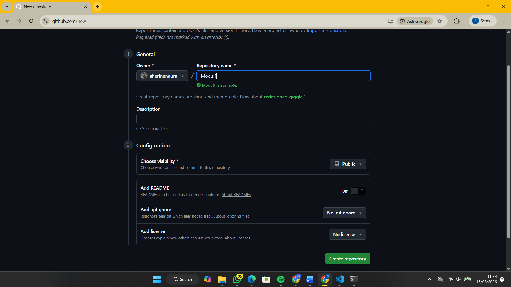
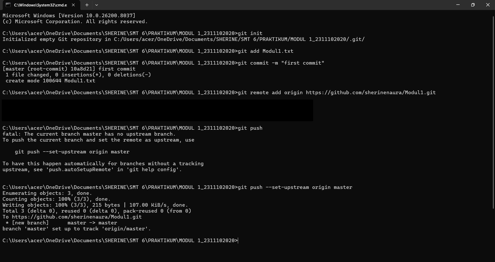
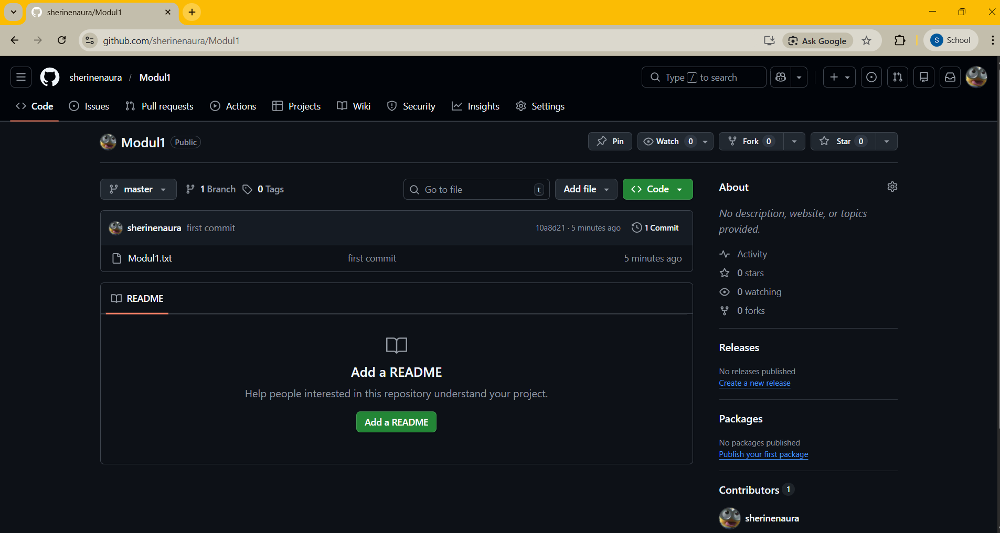

<div align="center">

# LAPORAN PRAKTIKUM
# APLIKASI BERBASIS PLATFORM

---

## MODUL 1
## SETUP REPOSITORY VIA CLI

---


---

**Disusun Oleh :**

**SHERINE NAURA EARLY GUNAWAN**

**2311102020**

**S1 IF-11-REG01**

---

**Dosen Pengampu :**

Dimas Fanny Hebrasianto Permadi, S.ST., M.Kom

---

**PROGRAM STUDI S1 INFORMATIKA**

**FAKULTAS INFORMATIKA**

**UNIVERSITAS TELKOM PURWOKERTO**

**2025/2026**

</div>

---

## 1. Dasar Teori

**-** Git merupakan sistem pengontrol versi terdistribusi (Distributed Version Control System) yang dirancang untuk mencatat setiap perubahan pada kumpulan berkas secara kronologis. Secara teoretis, Git memungkinkan pengelolaan integritas data dan kolaborasi multipengguna melalui mekanisme pencabangan (branching) dan penggabungan (merging) yang memastikan riwayat perubahan tetap terjaga secara konsisten.

**-** GitHub adalah platform manajemen proyek berbasis cloud yang berfungsi sebagai repositori pusat untuk menghosting proyek-proyek yang dikelola menggunakan Git. Secara fungsional, platform ini menyediakan infrastruktur untuk berbagi kode, manajemen isu, dan integrasi berkelanjutan, sehingga memungkinkan pengembang dari berbagai lokasi untuk bekerja pada satu basis kode yang sama secara terpusat.

**-** Command Line Interface (CLI) adalah antarmuka berbasis teks yang memungkinkan pengguna berinteraksi dengan sistem operasi atau perangkat lunak melalui instruksi-instruksi spesifik yang diketikkan. Dalam ekosistem pengembangan, CLI berfungsi sebagai jembatan komunikasi yang lebih efisien dan presisi dibandingkan antarmuka grafis, karena memberikan akses penuh terhadap fungsi-fungsi tingkat lanjut dari sebuah program.

---

## 2. Setup Repository via CLI

### - Membuat Repository Github
Langkah pertama yang harus dilakukan adalah membuat repository GitHub. Buka akun GitHub melalui browser, lalu buat sebuah Repository baru. Pastikan mengisi nama repository dengan benar dan mengatur visibilitasnya menjadi Public agar folder tersebut dapat diakses atau dilihat secara umum.



### - Menghubungkan ke Repository GitHub
Setelah persiapan di GitHub selesai, langkah berikutnya adalah menyiapkan folder yang sudah memiliki File di folder lokal. Buka Command Prompt (CMD) atau Terminal dari folder lokal tersebut. Jalankan perintah git init untuk menginisialisasi repository Git secara lokal.

```bash
git init
```

### - Memasukkan File yang Tersedia
Setelah repository lokal siap, masukkan file yang ingin diunggah ke dalam github menggunakan perintah di bawah ini. Langkah ini bertujuan untuk memberi tahu Git file mana saja yang sudah siap untuk dikirim ke GitHub.

```bash
git add Modul1.txt
```

### - Upload ke GitHub
Langkah terakhir adalah menyimpan perubahan tersebut secara permanen (commit) dan mengirimkannya (push) ke repository online.

```bash
git add .
git commit -m "first commit"
git branch -M main
git push -u origin main
```

---

## 3. Hasil




---

<div align="center">
</div>