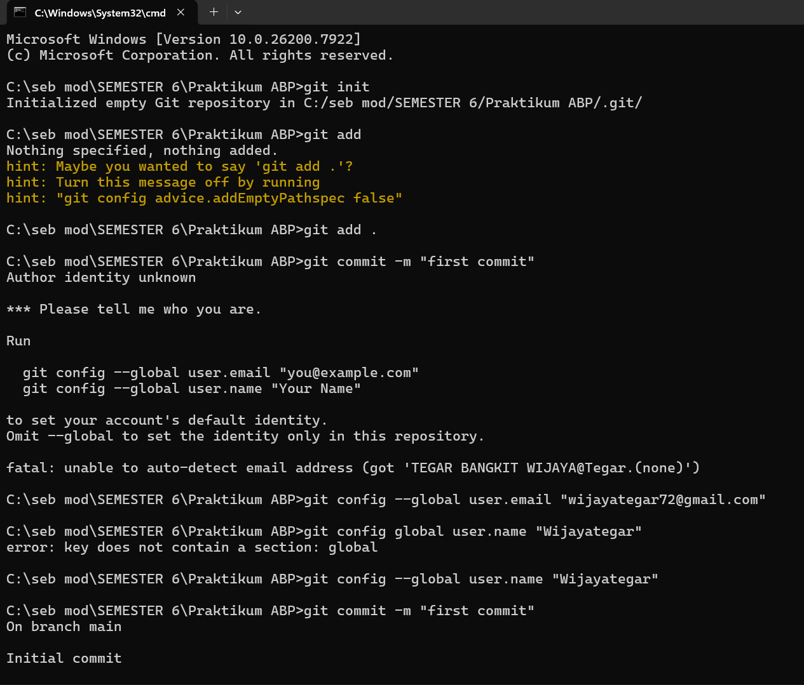
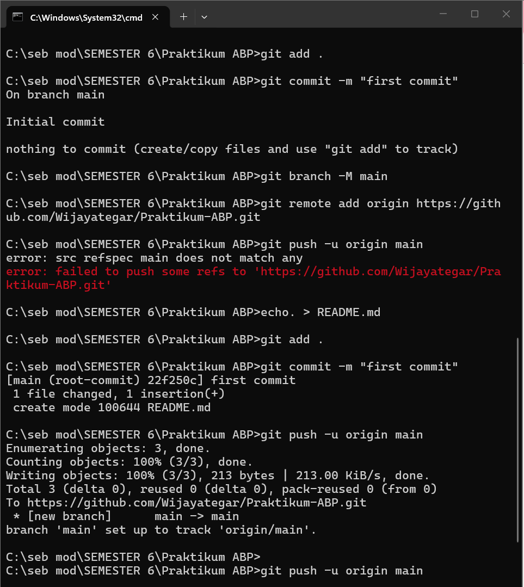

 <div align="center">

# LAPORAN PRAKTIKUM
# APLIKASI BERBASIS PLATFORM

---

## MODUL 1
## SETUP REPOSITORY VIA CLI

---


---

**Disusun Oleh :**

**TEGAR BANGKIT WIJAYA**

**2311102027**

**S1 IF-11-REG01**

---

**Dosen Pengampu :**

Dimas Fanny Hebrasianto Permadi, S.ST., M.Kom

---

**PROGRAM STUDI S1 INFORMATIKA**

**FAKULTAS INFORMATIKA**

**UNIVERSITAS TELKOM PURWOKERTO**

**2025/2026**

</div>

---

## 1. Dasar Teori

Git merupakan sistem version control terdistribusi yang dirancang untuk mengelola proyek perangkat lunak dari skala kecil hingga besar dengan kecepatan dan efisiensi tinggi. Git memungkinkan pengembang untuk melacak setiap perubahan yang terjadi pada file, membandingkan versi sebelumnya, serta mengembalikan file ke kondisi tertentu apabila diperlukan.

GitHub adalah layanan hosting berbasis cloud yang digunakan untuk menyimpan repositori Git secara online. GitHub memudahkan kolaborasi antar pengembang karena setiap anggota tim dapat mengakses, mengunduh, dan mengunggah perubahan kode dari mana saja.

Command Line Interface (CLI) adalah antarmuka berbasis teks yang memungkinkan pengguna berinteraksi langsung dengan sistem operasi menggunakan perintah teks. Berbeda dengan antarmuka grafis, CLI memberikan kontrol yang lebih langsung dan fleksibel terhadap sistem. Dalam praktikum ini CLI digunakan melalui Command Prompt (CMD) di Windows untuk menjalankan perintah-perintah Git.

Beberapa perintah dasar Git yang digunakan dalam praktikum ini antara lain:

- `git init` digunakan untuk menginisialisasi repositori Git baru pada folder lokal
- `git config` digunakan untuk mengatur konfigurasi Git seperti nama pengguna dan email
- `git add` digunakan untuk menambahkan file ke staging area sebelum di-commit
- `git commit` digunakan untuk menyimpan perubahan ke repositori lokal dengan pesan tertentu
- `git branch` digunakan untuk mengelola cabang pada repositori
- `git remote` digunakan untuk menghubungkan repositori lokal dengan repositori remote di GitHub
- `git push` digunakan untuk mengunggah perubahan dari repositori lokal ke repositori remote

---

## 2. Setup Repository via CLI

Berikut adalah langkah-langkah yang dilakukan untuk melakukan setup repositori Git dan menghubungkannya ke GitHub melalui CLI.

### 2.1 Konfigurasi Git
Sebelum menggunakan Git, perlu dilakukan konfigurasi identitas pengguna terlebih dahulu.
```bash
git config --global user.email "wijayategar72@gmail.com"
git config --global user.name "Wijayategar"
```

### 2.2 Inisialisasi Repository Lokal
Buka CMD dan masuk ke folder project, lalu jalankan perintah berikut.
```bash
git init
```

### 2.3 Membuat File README
Karena folder masih kosong, buat file README.md terlebih dahulu agar bisa di-commit.
```bash
echo. > README.md
```

### 2.4 Add dan Commit File
Tambahkan file ke staging area lalu simpan perubahan dengan commit.
```bash
git add .
git commit -m "first commit"
```

### 2.5 Menghubungkan ke Repository GitHub
Hubungkan repository lokal ke repository yang sudah dibuat di GitHub.
```bash
git branch -M main
git remote add origin https://github.com/Wijayategar/Praktikum-ABP.git
git push -u origin main
```

---

## 3. Hasil

Repository berhasil dibuat dan terhubung ke GitHub.




---

<div align="center">

*2311102027 - Tegar Bangkit Wijaya - S1 IF-11-REG01*

</div>
