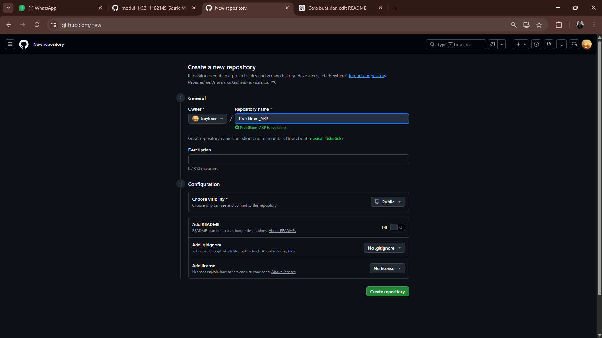
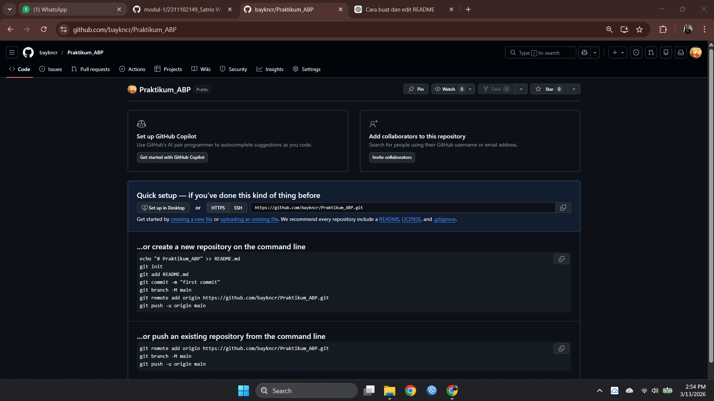
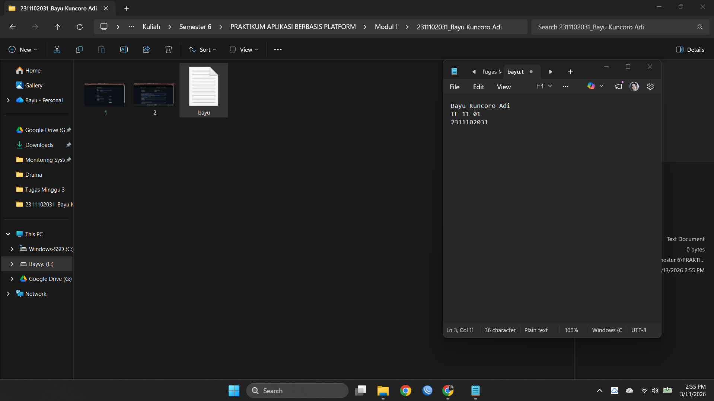
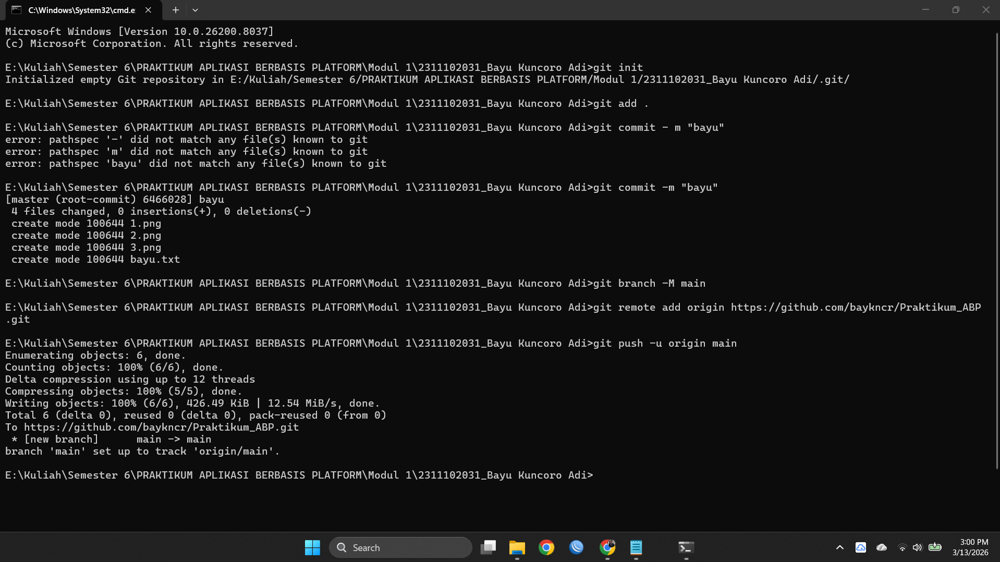
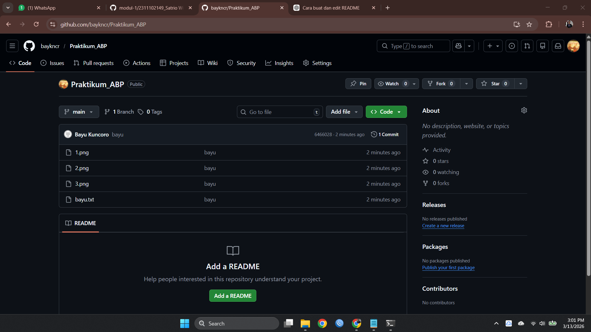

   
  <h1>LAPORAN PRAKTIKUM  APLIKASI BERBASIS PLATFORM</h1>
   
  <h2>MODUL 1   GIT</h2>
   
   
   
   
   
   
  <h3>Disusun Oleh :</h3>
  

    <strong>Bayu Kuncoro Adi</strong> 
    <strong>2311102031</strong> 
    <strong>S1 IF-11-REG 01</strong>
  

   
  <h3>Dosen Pengampu :</h3>
  

    <strong>Dimas Fanny Hebrasianto Permadi, S.ST., M.Kom</strong>
  

   
   
    <h4>Asisten Praktikum :</h4>
    <strong> Apri Pandu Wicaksono </strong>  
    <strong>Rangga Pradarrell Fathi</strong>
   
  <h2>LABORATORIUM HIGH PERFORMANCE
  FAKULTAS INFORMATIKA  UNIVERSITAS TELKOM PURWOKERTO  TAHUN 2026</h2>

---

# 1. Dasar Teori

### Mengenal Git: Sistem Pengontrol Versi Terdistribusi (Koneksi ke Github lewat Lokal)
**Git** adalah sistem pengontrol versi terdistribusi (Distributed Version Control System/DVCS) yang digunakan untuk melacak perubahan pada file atau kode sumber selama proses pengembangan perangkat lunak. Git memungkinkan banyak pengembang bekerja pada proyek yang sama secara bersamaan tanpa saling menimpa perubahan yang dibuat. Sistem ini pertama kali dikembangkan pada tahun 2005 oleh **Linus Torvalds** untuk membantu proses pengembangan **Linux Kernel**. Sebagai sistem terdistribusi, setiap pengguna memiliki salinan lengkap repository di komputer mereka sehingga pekerjaan dapat dilakukan secara offline dan perubahan dapat disinkronkan kembali ke repository utama ketika sudah siap. Git juga menyediakan berbagai fitur penting seperti pencatatan riwayat perubahan (commit), pembuatan cabang pengembangan (branch), penggabungan perubahan (merge), serta kemampuan untuk kembali ke versi sebelumnya jika terjadi kesalahan. Dalam praktiknya, Git sering digunakan bersama layanan penyimpanan repository berbasis internet seperti **GitHub**, **GitLab**, dan **Bitbucket** untuk memudahkan kolaborasi tim dan pengelolaan proyek perangkat lunak secara lebih terstruktur.

# 2. Set Up Repository lewat CLI

**Setup repository Git lewat CLI (Command Line Interface)** adalah proses membuat dan menyiapkan repository menggunakan perintah di terminal atau command prompt dengan bantuan **Git**. Cara ini sering digunakan oleh developer karena lebih cepat dan memberikan kontrol penuh terhadap pengelolaan proyek. Pertama, pengguna harus memastikan Git sudah terpasang di komputer. Setelah itu, buka terminal atau command prompt lalu masuk ke folder proyek menggunakan perintah `cd`. Untuk membuat repository Git baru di folder tersebut, gunakan perintah `git init`. Perintah ini akan membuat folder tersembunyi `.git` yang berisi semua data version control. Selanjutnya file proyek dapat ditambahkan ke staging area dengan perintah `git add .`, kemudian perubahan disimpan ke repository dengan perintah `git commit -m "commit pertama"`. Jika ingin menghubungkan repository lokal dengan repository online, misalnya di **GitHub**, pengguna dapat menambahkan remote repository menggunakan perintah `git remote add origin <url_repository>`. Setelah itu kode dapat dikirim ke repository online menggunakan perintah `git push -u origin main`. Dengan menggunakan CLI, proses setup repository Git menjadi lebih efisien dan merupakan metode yang umum digunakan dalam pengembangan perangkat lunak modern.

## Langkah 1: Pembuatan Repositori Baru di GitHub

Langkah pertama adalah membuat repository baru lewat Github di Web Browser. Repositori yang dibuat berfungsi untuk menyimpan proyek berbasis cloud, sehingga code program dapat dikembangkan dan di sebarluaskan secar efisien.

---

## Langkah 2: Panduan Perintah Dasar Git

Setelah repositori berhasil dibuat, antarmuka **GitHub** akan secara otomatis menampilkan panduan berupa serangkaian perintah **Git**. Perintah-perintah tersebut berfungsi sebagai petunjuk penting untuk menghubungkan folder proyek yang tersimpan secara lokal di komputer dengan repositori yang berada secara online di GitHub.

---

## Langkah 3: Penyiapan Folder Proyek dan File Awal

Langkah selanjutnya adalah menyiapkan direktori proyek di komputer, misalnya dengan membuat folder bernama **Modul 1/2311102031_Bayu Kuncoro Adi**. Di dalam folder tersebut, buat setidaknya satu file contoh seperti **bayu.txt** sebagai konten awal repositori. Selain itu, Anda juga dapat menambahkan berbagai file lain yang diperlukan untuk mendukung kebutuhan proyek tersebut.

---

## Langkah 4: Membuka Terminal dari Direktori Proyek

Buka **Command Prompt (CMD)** atau terminal pada sistem operasi yang digunakan, kemudian arahkan direktori kerja ke folder proyek yang telah dibuat. Langkah ini dilakukan agar setiap perintah dari **Git** yang dijalankan dapat langsung diterapkan pada folder proyek tersebut.

---

## Langkah 5: Eksekusi Perintah Git (Proses Push ke GitHub)

Pada tahap ini, jalankan perintah-perintah **Git** yang sebelumnya diberikan oleh **GitHub** secara berurutan melalui terminal. Alur prosesnya meliputi beberapa langkah, yaitu menginisialisasi pelacakan Git pada direktori lokal dengan perintah `git init`, menambahkan perubahan file ke dalam *staging area* menggunakan `git add`, menyimpan perubahan tersebut sebagai riwayat permanen di repository lokal melalui `git commit`, menghubungkan repository lokal dengan repository *remote* yang ada di GitHub, serta mengunggah seluruh file beserta riwayat perubahannya ke GitHub menggunakan perintah `git push`.

---

## Langkah 6: Pembaruan Repositori Berhasil

Jika proses *push* berhasil dijalankan tanpa muncul pesan kesalahan, maka seluruh file beserta struktur folder yang sebelumnya hanya tersimpan di perangkat lokal akan otomatis tersalin ke repositori di **GitHub** melalui **Git**. Dengan begitu, proyek tersebut dapat diakses secara online dan siap untuk dikembangkan lebih lanjut, termasuk melalui kolaborasi dengan pengembang lainnya.

### Refrensi

- [Materi Modul 1](https://drive.google.com/file/d/1v2HYQXoUcKedERxtmi9eJqeZ1MsQZ5T4/view?usp=drive_link)