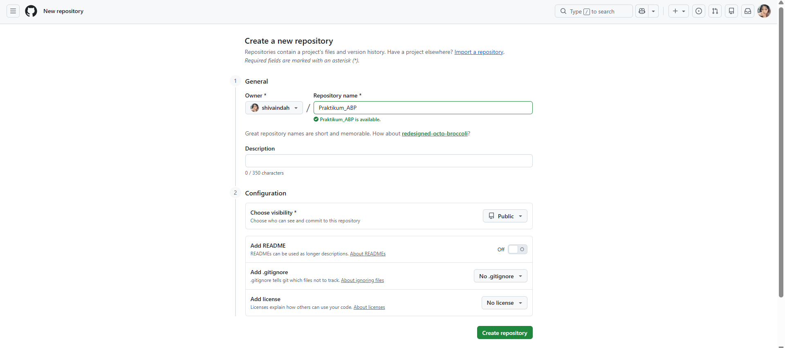
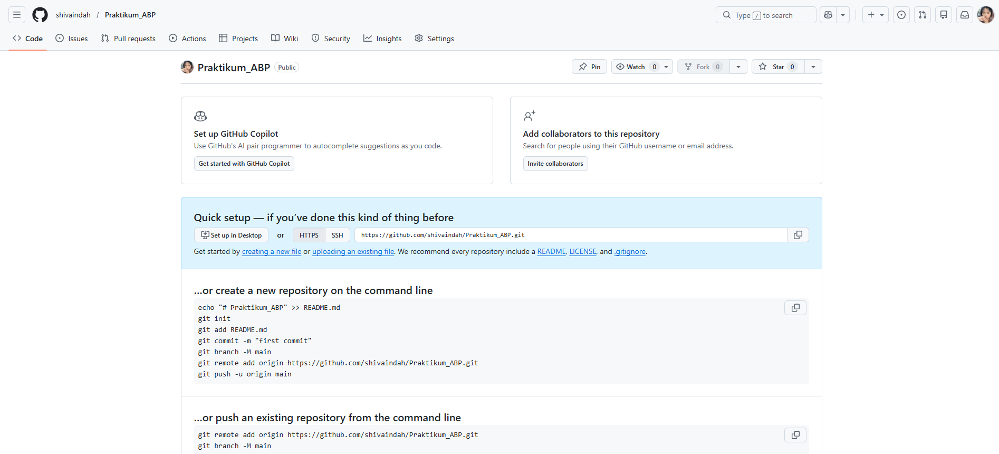
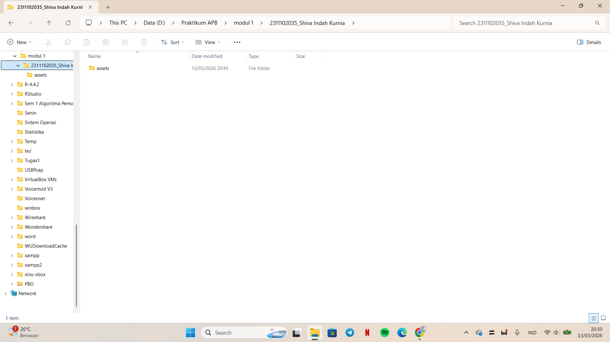
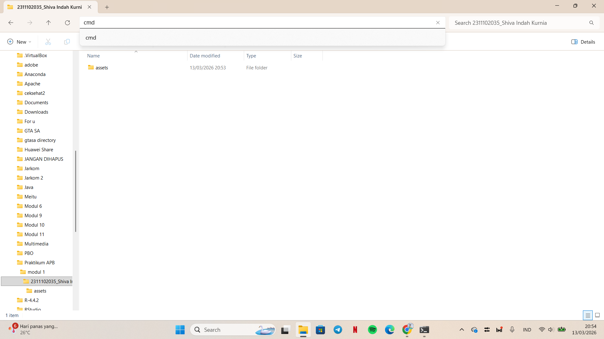
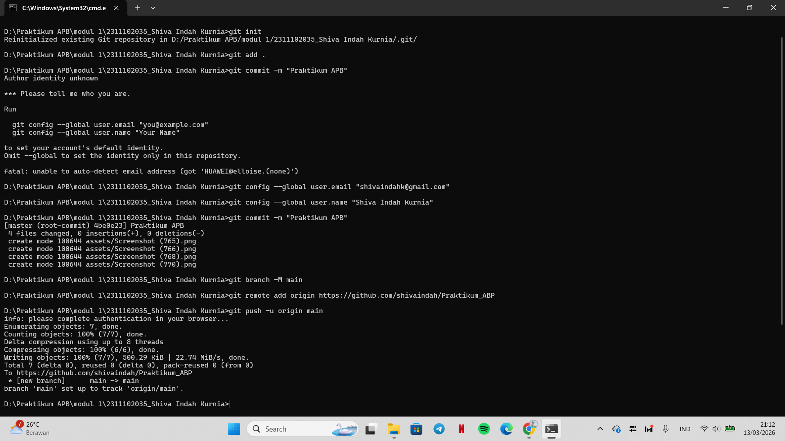
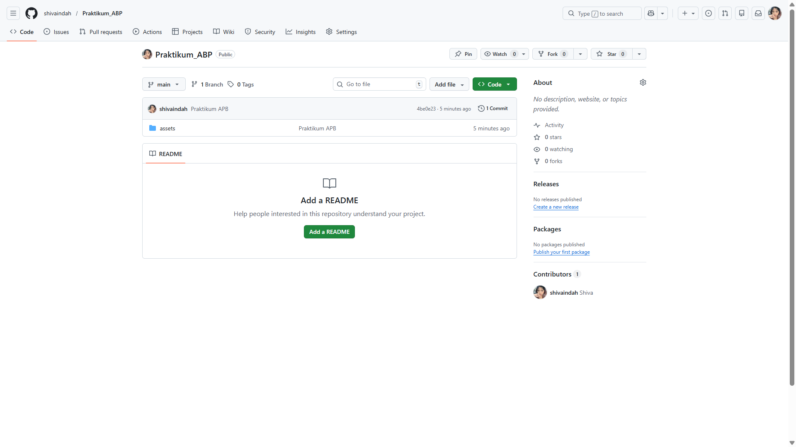



   
  <h1>LAPORAN PRAKTIKUM  APLIKASI BERBASIS PLATFORM</h1>
   
  <h3>MODUL 1   GIT</h3>
   
   
   
   
   
  <h3>Disusun Oleh :</h3>
  

    <strong>Shiva Indah Kurnia</strong> 
    <strong>2311102035</strong> 
    <strong>S1 IF-11-01</strong>
  

   
  <h3>Dosen Pengampu :</h3>
  

    <strong>Dimas Fanny Hebrasianto Permadi, S.ST., M.Kom</strong>
  

   
   
    <h4>Asisten Praktikum :</h4>
    <strong> Apri Pandu Wicaksono </strong>  
    <strong>Rangga Pradarrell Fathi</strong>
   
  <h3>LABORATORIUM HIGH PERFORMANCE
  FAKULTAS INFORMATIKA  UNIVERSITAS TELKOM PURWOKERTO  2026</h3>

---

## 1. Dasar Teori

**Git** adalah sistem pengontrol versi (Version Control System) terdistribusi yang sangat berguna bagi para pengembang perangkat lunak untuk melacak perubahan riwayat file dan mempermudah kolaborasi kode. Sedangkan **GitHub** adalah platform layanan hosting berbasis web untuk repositori Git yang memudahkan kita menyimpan proyek secara online.

**Command Line Interface (CLI)** adalah antarmuka teks di mana pengguna dapat mengetikkan perintah langsung untuk berinteraksi dengan sistem komputer. Dalam praktikum ini, kita menggunakan CLI (seperti Command Prompt atau Terminal) untuk mengeksekusi perintah-perintah Git dengan lebih cepat dan efisien.

---

## 2. Setup Repository via CLI

Berikut adalah urutan langkah-langkah untuk melakukan inisialisasi dan setup repositori dari lokal ke GitHub melalui CLI:

### Langkah 1: Membuat Repositori Baru di GitHub

Langkah pertama adalah membuat repositori di GitHub. Wadah ini berfungsi sebagai pusat penyimpanan daring agar kode dapat dikelola dan diakses dengan mudah melalui internet.

### Langkah 2: Panduan Perintah Git

Begitu repositori siap, GitHub akan menampilkan daftar perintah Git. Instruksi ini berfungsi untuk menyinkronkan proyek di komputer lokal dengan repositori daring tersebut.

### Langkah 3: Membuat Folder Proyek dan File

Buat folder khusus di komputer dan masukkan seluruh file proyek yang ingin diunggah ke repositori.
### Langkah 4: Membuka CMD dari Direktori Folder Proyek

Buka Command Prompt atau Terminal, lalu arahkan direktori aktif ke folder proyek tersebut untuk memastikan perintah Git dieksekusi pada lokasi yang tepat.

### Langkah 5: Menjalankan Perintah Git di Terminal (Push ke GitHub)

alankan rangkaian perintah sesuai instruksi GitHub, mulai dari inisialisasi (git init), pendaftaran file (git add), pembuatan rekaman perubahan (git commit), pengaturan remote, hingga pengunggahan data (git push).

### Langkah 6: Repositori Berhasil Diperbarui

Periksa halaman repositori di GitHub untuk memastikan seluruh file telah berhasil terunggah.

## Refrensi
- [Materi Modul 1](https://drive.google.com/file/d/1sAJR4AconN_aZjvLF-GTY0DM-e84pL63/view?usp=sharing)
