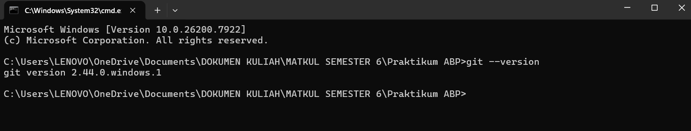
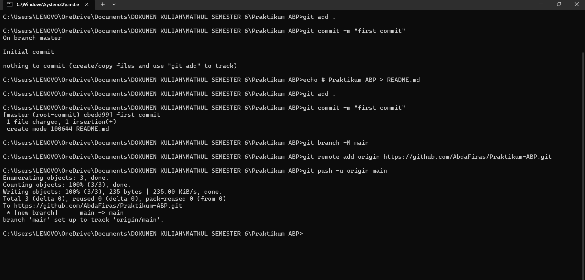
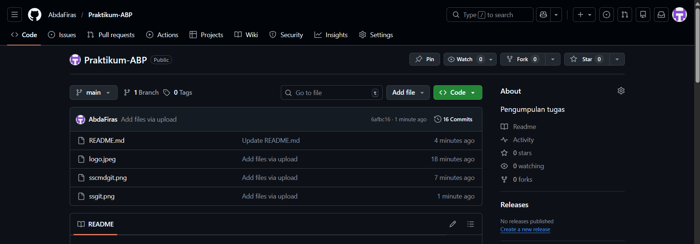

   

  <h1>LAPORAN PRAKTIKUM  
  APLIKASI BERBASIS PLATFORM
  </h1>

   

  <h3>MODUL I  
  GIT
  </h3>

   

  

   
   
   

  <h3>Disusun Oleh :</h3>

  

    <strong>Abda Firas Rahman</strong> 
    <strong>2311102049</strong> 
    <strong>S1 IF-11-01</strong>
  

   

  <h3>Dosen Pengampu :</h3>

  

    <strong>Dimas Fanny Hebrasianto Permadi, S.ST., M.Kom</strong>
  

  
   
   
    <h4>Asisten Praktikum :</h4>
    <strong>Apri Pandu Wicaksono </strong>  
    <strong>Rangga Pradarrell Fathi</strong>
   

  <h3>LABORATORIUM HIGH PERFORMANCE
  FAKULTAS INFORMATIKA  UNIVERSITAS TELKOM PURWOKERTO  2026</h3>

## Dasar Teori

### Apa itu Git?

Git adalah sistem version control yang digunakan untuk mengelola dan melacak perubahan pada file atau kode dalam sebuah project. Git membantu developer menyimpan riwayat perubahan sehingga jika terjadi kesalahan kita bisa kembali ke versi sebelumnya. Selain itu Git juga memudahkan banyak orang untuk bekerja pada project yang sama secara bersamaan tanpa takut file saling tertimpa.Dengan Git, setiap perubahan yang dilakukan pada project dapat dicatat melalui proses commit, lalu disimpan di repository baik secara lokal maupun online seperti di GitHub.

### Instalasi Git

Sebelum menggunakan Git, kita perlu melakukan instalasi terlebih dahulu pada komputer. Git dapat diunduh melalui website resminya yaitu https://git-scm.com. Setelah masuk ke website tersebut, pilih tombol download sesuai dengan sistem operasi yang digunakan. Setelah file installer berhasil diunduh, jalankan file tersebut dan ikuti langkah-langkah instalasi sampai selesai. Setelah proses instalasi selesai, Git dapat dicek apakah sudah terpasang dengan benar atau belum melalui Command Prompt atau terminal dengan mengetik perintah: git --version

Berikut hasil pengecekan versi Git:

### Penggunaan Git

Secara umum Git digunakan untuk mengelola perubahan pada sebuah project atau software. Dengan Git, setiap perubahan pada file dapat dilacak sehingga memudahkan developer untuk bekerja secara terstruktur. Berikut beberapa penggunaan Git yang sering dilakukan:

#### 1. Membuat repository baru

Untuk memulai penggunaan Git pada sebuah project, kita dapat membuat repository baru dengan perintah `git init`. Perintah ini akan membuat folder tersembunyi bernama `.git` di dalam project. Folder tersebut berfungsi sebagai tempat Git menyimpan seluruh riwayat perubahan pada project.

#### 2. Menambahkan file ke repository

Setelah repository dibuat, file yang ada di dalam project dapat ditambahkan ke Git. Biasanya file dimasukkan terlebih dahulu menggunakan perintah `git add`, kemudian perubahan tersebut disimpan menggunakan perintah `git commit -m "pesan commit"`. Commit ini berfungsi untuk mencatat perubahan yang telah dilakukan pada project.

#### 3. Membuat repository secara online

Selain repository lokal di komputer, kita juga bisa membuat repository secara online menggunakan platform seperti GitHub. Repository online ini berfungsi sebagai tempat penyimpanan project sehingga dapat diakses dari mana saja serta memudahkan kolaborasi dengan orang lain.

#### 4. Mengirim project ke repository online

Setelah repository online dibuat, project dari komputer dapat dihubungkan dengan repository tersebut. Caranya dengan menambahkan alamat repository menggunakan perintah:

`git remote add origin https://github.com/username/namarepository.git`

Perintah ini akan menghubungkan repository lokal dengan repository yang ada di GitHub. Setelah itu, file project dapat dikirim ke repository online menggunakan perintah:

`git push -u origin main`

#### 5. Mengambil atau menyalin repository orang lain

Git juga memungkinkan kita untuk menyalin repository milik orang lain ke komputer kita. Proses ini disebut dengan clone. Langkahnya yaitu membuka repository yang ingin diambil di GitHub, kemudian menyalin link repository tersebut. Setelah itu jalankan perintah berikut di terminal atau command prompt:

`git clone [link repository]`

Dengan perintah tersebut, seluruh isi repository beserta riwayat perubahannya akan tersalin ke komputer kita.
## Tugas

### 1. Melakukan setup repository via CLI

### Output

Gambar tersebut menunjukkan tahapan pembuatan repository menggunakan Git melalui command line. Proses dimulai dari perintah `git init` untuk membuat repository lokal pada folder project. Setelah itu dilakukan penambahan file ke dalam repository menggunakan perintah `git add`, kemudian menyimpan perubahan dengan `git commit`. Selanjutnya dilakukan pembuatan branch utama dan menghubungkan repository lokal dengan repository yang ada di GitHub. Tahap terakhir adalah mengirimkan file ke repository online menggunakan perintah `git push origin main`.

Gambar berikut menampilkan hasil dari perintah-perintah Git yang telah dijalankan sebelumnya. Dari tampilan tersebut dapat dilihat bahwa proses upload project ke GitHub berhasil dilakukan. Hal ini menandakan bahwa file yang ada pada repository lokal sudah tersimpan dan dapat diakses pada repository online melalui Git CLI.
