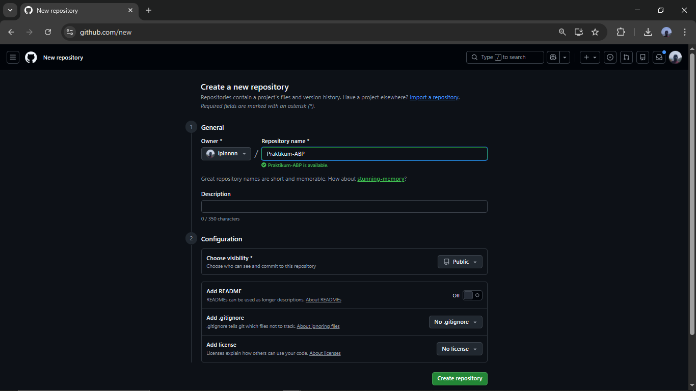
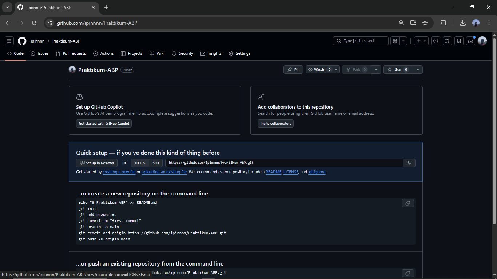
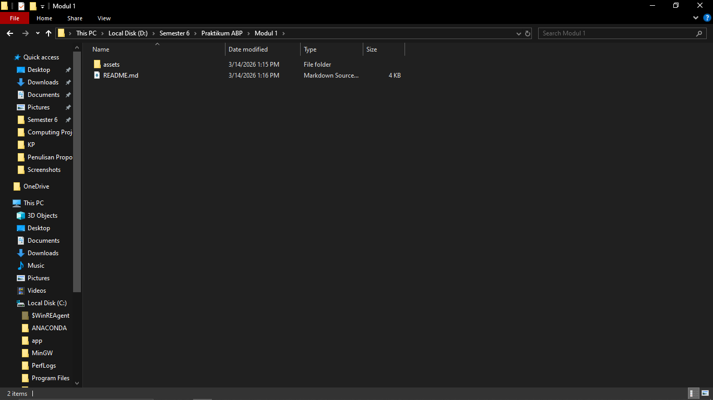
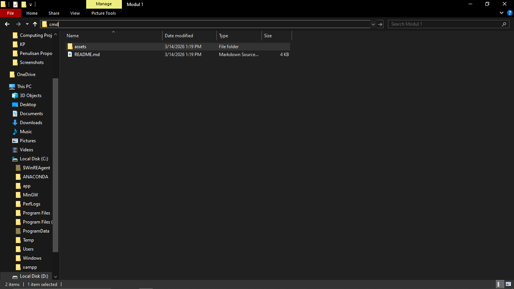
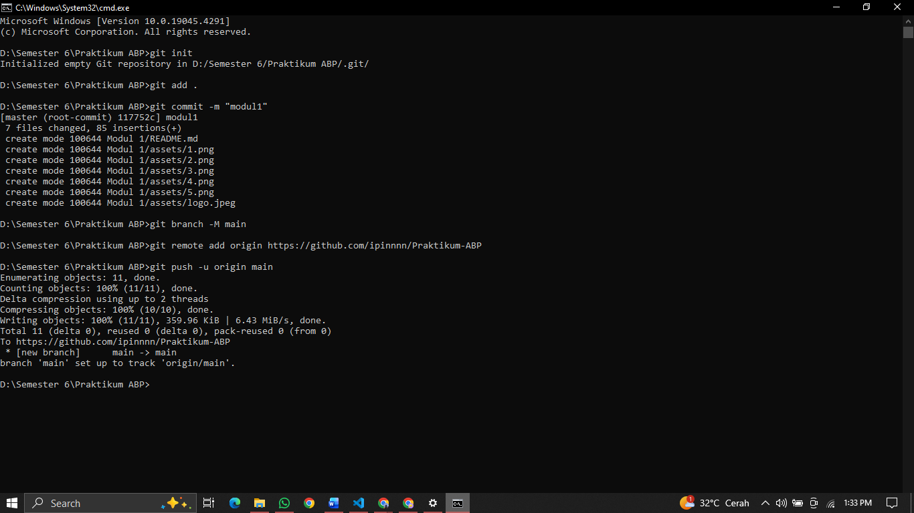
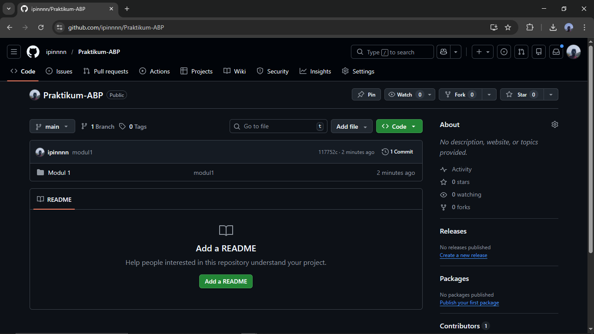



   
  <h1>LAPORAN PRAKTIKUM  APLIKASI BERBASIS PLATFORM</h1>
   
  <h3>MODUL 1   GIT</h3>
   
   
   
   
   
  <h3>Disusun Oleh :</h3>
  

    <strong>Muhammad Hamzah Haifan Ma'ruf</strong> 
    <strong>2311102091</strong> 
    <strong>S1 IF-11-01</strong>
  

   
  <h3>Dosen Pengampu :</h3>
  

    <strong>Dimas Fanny Hebrasianto Permadi, S.ST., M.Kom</strong>
  

   
   
    <h4>Asisten Praktikum :</h4>
    <strong> Apri Pandu Wicaksono </strong>  
    <strong>Rangga Pradarrell Fathi</strong>
   
  <h3>LABORATORIUM HIGH PERFORMANCE
  FAKULTAS INFORMATIKA  UNIVERSITAS TELKOM PURWOKERTO  2026</h3>

---

## 1. Landasan Teori

**Git** merupakan sistem kontrol versi terdistribusi (Distributed Version Control System) yang digunakan oleh pengembang perangkat lunak untuk mencatat serta melacak perubahan pada file proyek. Dengan Git, riwayat perubahan kode dapat dipantau dengan mudah sehingga memudahkan proses kolaborasi antar developer. Sementara itu, **GitHub** adalah layanan berbasis web yang menyediakan hosting untuk repositori Git, sehingga proyek dapat disimpan, dikelola, dan diakses secara online.

**Command Line Interface (CLI)** adalah antarmuka berbasis teks yang memungkinkan pengguna menjalankan berbagai perintah langsung ke sistem komputer. Pada praktikum ini, CLI seperti Command Prompt atau Terminal dimanfaatkan untuk menjalankan perintah Git secara langsung, yang umumnya lebih cepat dan efisien dibandingkan menggunakan antarmuka grafis.

---

## 2. Setup Repository melalui CLI

Berikut merupakan tahapan yang dilakukan untuk melakukan inisialisasi serta menghubungkan repositori lokal dengan repositori di GitHub menggunakan CLI:

### Langkah 1: Membuat Repository Baru di GitHub

Tahapan pertama adalah membuat repository baru pada GitHub. Repository ini berfungsi sebagai tempat penyimpanan proyek secara online, sehingga seluruh file dan kode yang dibuat dapat tersimpan dengan aman serta dapat diakses melalui internet.

### Langkah 2: Melihat Panduan Perintah Git

Setelah repository berhasil dibuat, GitHub akan menampilkan beberapa instruksi berupa perintah Git. Perintah-perintah tersebut digunakan untuk menghubungkan proyek yang ada di komputer lokal dengan repository yang sudah dibuat di GitHub.

### Langkah 3: Membuat Folder Proyek dan File

Pada tahap ini, dibuat sebuah folder proyek pada komputer lokal. Di dalam folder tersebut kemudian ditambahkan file yang nantinya akan diunggah ke repository GitHub.

### Langkah 4: Membuka CMD pada Direktori Proyek

Selanjutnya, buka Command Prompt (CMD) atau Terminal dan pastikan lokasi direktori aktif berada pada folder proyek yang telah dibuat. Hal ini penting agar perintah Git yang dijalankan diterapkan pada proyek yang benar.

### Langkah 5: Menjalankan Perintah Git di Terminal (Push ke GitHub)

Pada langkah ini, jalankan perintah Git sesuai dengan panduan yang diberikan oleh GitHub. Proses dimulai dengan menginisialisasi repository lokal menggunakan `git init`, kemudian menambahkan file menggunakan `git add`, membuat commit dengan `git commit`, menghubungkan repository lokal dengan repository GitHub melalui `remote`, dan terakhir mengunggah file menggunakan `git push`.

### Langkah 6: Repository Berhasil Diperbarui

Terakhir, periksa halaman repository di GitHub untuk memastikan bahwa file yang telah di-*push* dari komputer lokal sudah berhasil muncul di repository.

---

## Referensi

- [Materi Modul 1](https://drive.google.com/file/d/1sAJR4AconN_aZjvLF-GTY0DM-e84pL63/view?usp=sharing)