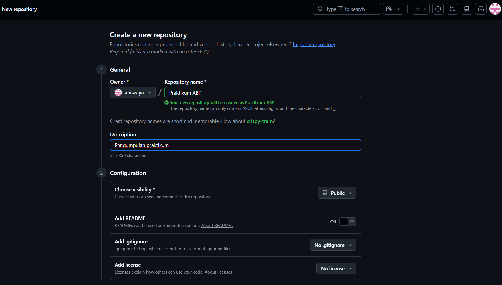
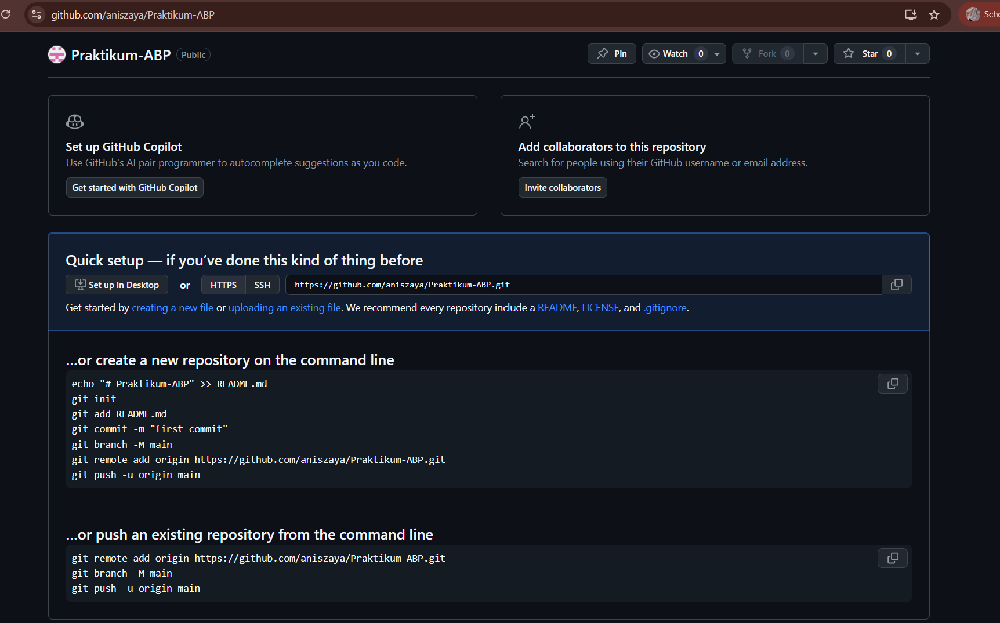
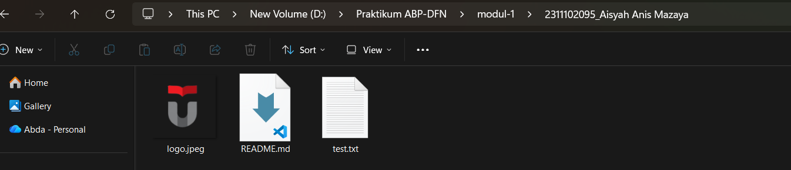
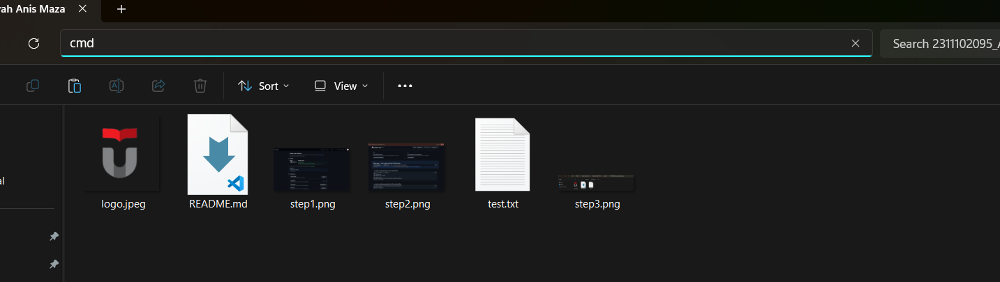
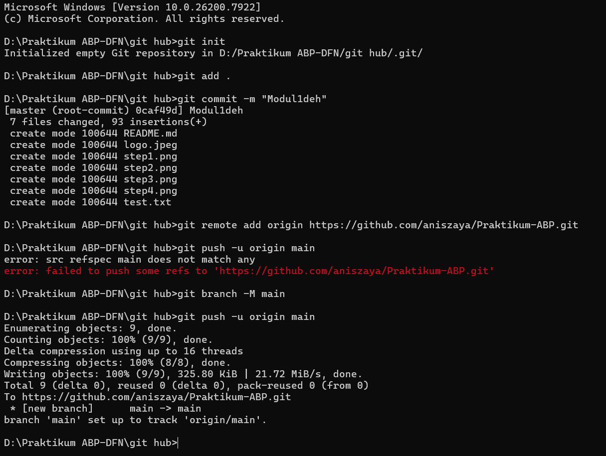
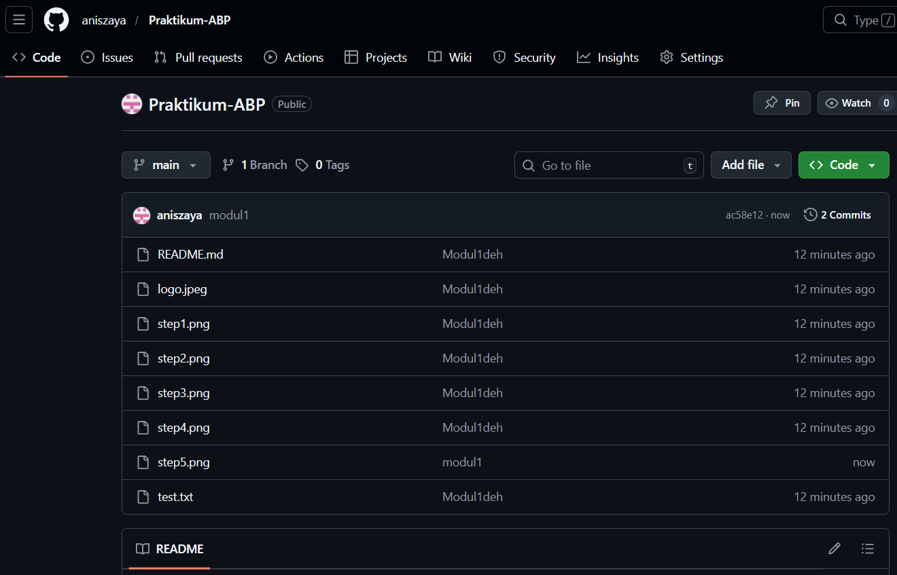

   

  <h1>LAPORAN PRAKTIKUM  
  APLIKASI BERBASIS PLATFORM
  </h1>

   

  <h3>MODUL I  
  GIT
  </h3>

   

  

   
   
   

  <h3>Disusun Oleh :</h3>

  

    <strong>Aisyah Anis Mazaya</strong> 
    <strong>2311102095</strong> 
    <strong>S1 IF-11-REG01</strong>
  

   

  <h3>Dosen Pengampu :</h3>

  

    <strong>Dimas Fanny Hebrasianto Permadi, S.ST., M.Kom</strong>
  

  
   
   
    <h4>Asisten Praktikum :</h4>
    <strong>Apri Pandu Wicaksono </strong>  
    <strong>Rangga Pradarrell Fathi</strong>
   

  <h3>LABORATORIUM HIGH PERFORMANCE
  FAKULTAS INFORMATIKA  UNIVERSITAS TELKOM PURWOKERTO  2026</h3>

### Dasar Teori

Git merupakan sebuah sistem pengendali versi (version control system) yang berfungsi untuk mengatur serta memantau setiap perubahan pada file atau kode dalam suatu proyek. Dengan menggunakan Git, pengembang dapat menyimpan catatan riwayat perubahan sehingga apabila terjadi kesalahan, versi sebelumnya dari proyek masih dapat dipulihkan dengan mudah.

Selain itu, Git juga memungkinkan beberapa orang bekerja pada proyek yang sama secara bersamaan tanpa risiko perubahan file saling menimpa. Setiap perubahan yang dibuat akan direkam melalui proses commit, kemudian disimpan dalam sebuah repository yang dapat berada di penyimpanan lokal maupun di layanan daring seperti GitHub.

### Setup repo git via CLI
Untuk menghubungkan proyek lokal ke GitHub melalui CLI, langkah pertama adalah melakukan inisialisasi menggunakan git init guna membentuk struktur repositori. Selanjutnya, seluruh berkas dimasukkan ke dalam staging area dengan git add dan dikunci melalui commit sebagai rekaman versi.

Tahap berikutnya adalah menyelaraskan identitas cabang utama menggunakan perintah git branch agar sesuai dengan standar main pada GitHub. Setelah itu, dilakukan registrasi URL remote untuk menentukan alamat server tujuan. Prosedur diakhiri dengan instruksi push, yang secara teknis mengirimkan seluruh data dari penyimpanan lokal ke repositori daring sehingga proyek terintegrasi secara sempurna.

## Step 1 membuat repository di github
Tahap pertama adalah membuat repositori baru di platform GitHub. Repositori ini akan digunakan sebagai tempat penyimpanan proyek berbasis cloud, sehingga kode yang dikembangkan dapat dikelola serta dibagikan dengan lebih mudah dan efisien.

## Step 2 Perintah dasar dari GIT
Setelah repositori berhasil dibuat, antarmuka GitHub secara otomatis menampilkan panduan berupa kumpulan perintah Git. Perintah-perintah tersebut berfungsi sebagai instruksi penting untuk menghubungkan folder proyek yang ada di penyimpanan lokal komputer dengan repositori online di GitHub.

## Step 3 Penyiapan folder proyek
Langkah berikutnya adalah menyiapkan direktori proyek pada komputer, misalnya dengan membuat sebuah folder bernama Modul_1. Di dalam folder tersebut, buat minimal satu file contoh seperti test.txt sebagai isi awal repositori. Selain itu, Anda juga dapat menambahkan file lain yang diperlukan untuk mendukung proyek tersebut.

## Step 4 Membuka Terminal dari proyek untuk mempercepat
Buka Command Prompt (CMD) atau terminal pada sistem operasi yang Anda gunakan, kemudian ubah atau arahkan path menuju folder proyek yang telah dibuat sebelumnya.

## Step 5 melakukan perintah GIT
Analisis Alur Kerja Git:

Inisialisasi (git init): Memulai dengan membuat repositori lokal baru di dalam folder git hub. Perintah ini menyiapkan folder tersembunyi .git untuk mencatat setiap sejarah perubahan file.

Staging Area (git add .): Menandai 7 file (seperti README.md, logo.jpeg, dan beberapa gambar step) untuk dipersiapkan masuk ke dalam catatan permanen. Tanda titik . artinya kamu memasukkan semua file yang ada di folder tersebut sekaligus.

Penyimpanan Lokal (git commit -m "Modul1deh"): Menyimpan file-file tersebut ke dalam riwayat Git lokal dengan pesan "Modul1deh". Di sini terlihat Git otomatis membuat cabang bernama master.

Menghubungkan Server (git remote add origin): Mendaftarkan alamat repositori daring (GitHub) milikmu ke dalam konfigurasi lokal dengan nama alias origin.

Sinkronisasi Cabang (git branch -M main): Karena awalnya Git membuat cabang bernama master, mengubah namanya menjadi main agar sesuai dengan standar cabang utama di GitHub. Ini adalah langkah kunci yang memperbaiki error sebelumnya.

Pengunggahan Data (git push -u origin main): Langkah terakhir ini berhasil mengirimkan seluruh data dari komputer lokal ke server GitHub. Pesan main -> main menunjukkan bahwa cabang lokal dan cabang daring sekarang sudah sinkron.

## Step 6 Cek repository di GITHUB
Apabila proses push berhasil dilakukan tanpa muncul kesalahan maka semua file beserta struktur folder yang sebelumnya hanya tersimpan di komputer lokal akan ikut terunggah ke repositori GitHub. Dengan kondisi tersebut, proyek telah tersimpan secara online sehingga dapat diakses serta dilanjutkan pengembangannya secara kolaboratif.

