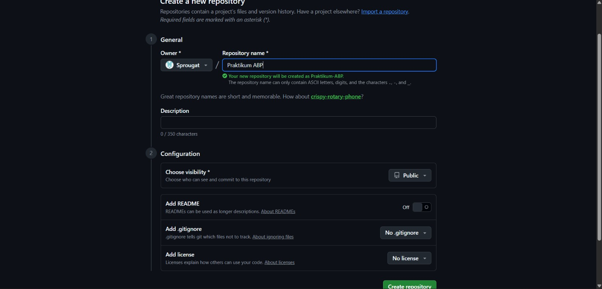
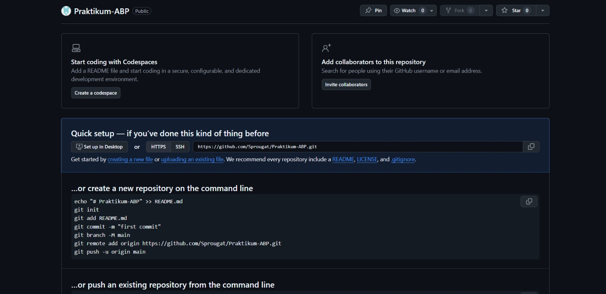
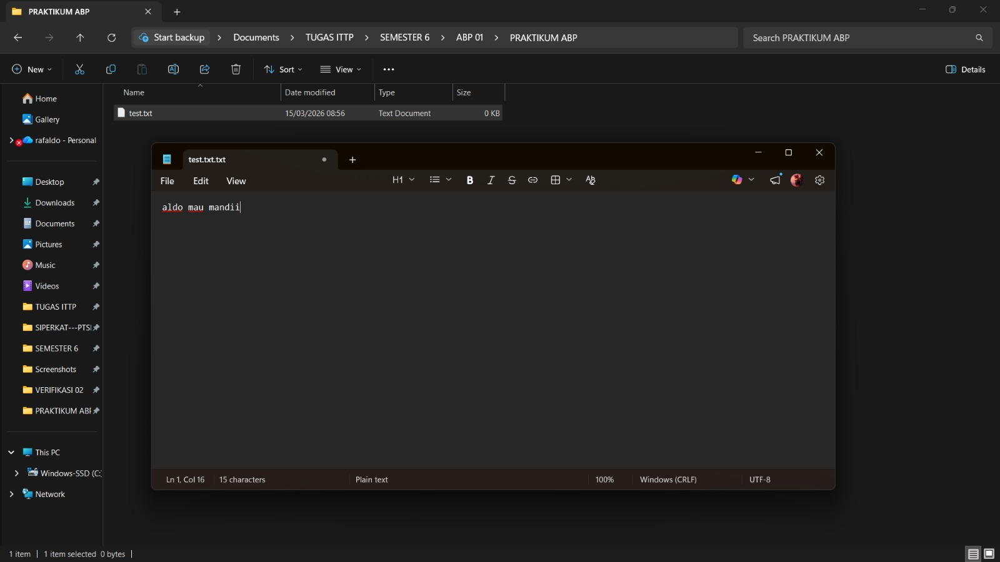
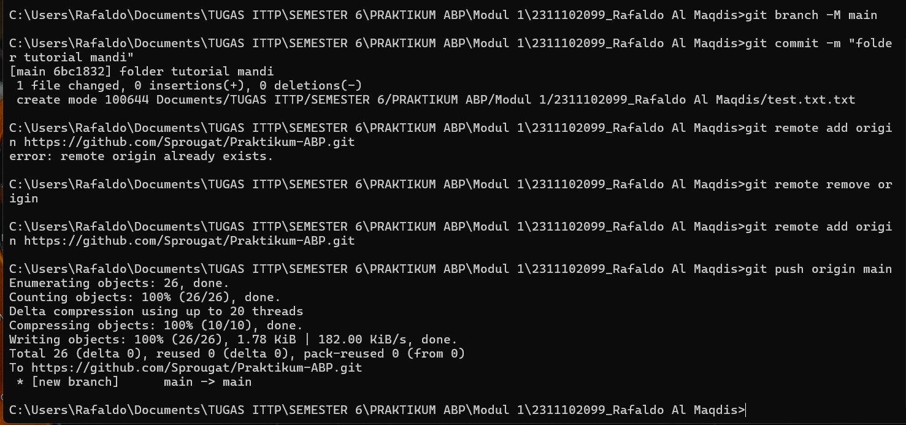

   
  <h1>LAPORAN PRAKTIKUM  APLIKASI BERBASIS PLATFORM</h1>
   
  <h2>MODUL 1  GIT</h2>
   
   
   
   
   
   
  <h3>Disusun Oleh :</h3>
  

    <strong>RAFALDO AL MAQDIS</strong> 
    <strong>2311102099</strong> 
    <strong>S1 IF-11-REG 01</strong>
  

   
  <h3>Dosen Pengampu :</h3>
  

    <strong>Dimas Fanny Hebrasianto Permadi, S.ST., M.Kom</strong>
  

   
   
    <h4>Asisten Praktikum :</h4>
    <strong> Apri Pandu Wicaksono </strong>  
    <strong>Rangga Pradarrell Fathi</strong>
   
  <h2>LABORATORIUM HIGH PERFORMANCE
  FAKULTAS INFORMATIKA  UNIVERSITAS TELKOM PURWOKERTO  2026</h2>

---

# 1. Dasar Teori

## Pengenalan Git sebagai Sistem Pengelola Versi

Git adalah sebuah Version Control System (VCS) yang pertama kali dikembangkan oleh Linus Torvalds dan saat ini banyak digunakan dalam proses pengembangan perangkat lunak. Sistem ini berperan dalam membantu pengembang untuk mengelola serta mendokumentasikan setiap perubahan yang terjadi pada sebuah proyek.

Secara umum, Git memiliki beberapa fungsi utama, di antaranya sebagai berikut:

- **Mencatat Riwayat Perubahan**  
  Git dapat menyimpan dan melacak setiap perubahan yang terjadi pada kode program maupun dokumen di dalam suatu proyek. Dengan adanya riwayat perubahan ini, pengembang dapat melihat perubahan yang telah dilakukan sebelumnya sehingga memudahkan proses pengelolaan proyek, baik secara individu maupun dalam tim.

- **Menggunakan Sistem Terdistribusi**  
  Berbeda dengan sistem pengontrol versi generasi sebelumnya yang bersifat terpusat, Git menerapkan konsep distribusi dalam pengelolaan dan penyimpanan datanya.

---

# 2. Setup Repository melalui CLI

Bagian ini menjelaskan tahapan untuk membuat serta mengatur repository dari komputer lokal agar dapat terhubung dengan repository yang ada di GitHub menggunakan **Command Line Interface (CLI)**.

### Apa yang dimaksud dengan sistem terdistribusi?

Dalam Git, data yang berisi riwayat versi proyek tidak hanya tersimpan pada satu server utama. Setiap pengembang memiliki salinan lengkap repository beserta seluruh histori perubahan pada perangkat komputer masing-masing. Hal ini membuat proses pengembangan menjadi lebih fleksibel dan tidak sepenuhnya bergantung pada satu server pusat.

---
---

## Langkah 1: Membuat Repository Baru di GitHub

Tahap awal yang perlu dilakukan adalah membuat repository baru melalui platform GitHub. Repository ini berfungsi sebagai tempat penyimpanan proyek secara online sehingga kode program dapat dikelola, disimpan, dan dibagikan dengan lebih mudah kepada orang lain.

---

## Langkah 2: Melihat Panduan Perintah Git

Setelah repository berhasil dibuat, GitHub biasanya akan menampilkan beberapa contoh perintah Git yang dapat digunakan untuk menghubungkan folder proyek yang berada di komputer lokal dengan repository yang telah dibuat di GitHub..

---

## Langkah 3: Menyiapkan Folder Proyek dan File Awal

Langkah berikutnya adalah membuat sebuah folder proyek pada komputer, misalnya:

Modul 1/2311102099_Rafaldo Al Maqdis

Di dalam folder tersebut dapat dibuat sebuah file awal seperti test.txt sebagai contoh isi repository. Selain itu, pengguna juga dapat menambahkan berbagai file lain sesuai dengan kebutuhan proyek yang sedang dikerjakan.

---

## Langkah 4: Membuka Terminal pada Folder Proyek

Selanjutnya, buka **Command Prompt (CMD)** atau terminal pada sistem operasi yang digunakan. Setelah itu, arahkan direktori menuju folder proyek yang telah dibuat sebelumnya agar setiap perintah Git yang dijalankan dapat diterapkan pada direktori tersebut.

---

## Langkah 5: Menjalankan Perintah Git (Push ke GitHub)

Pada tahap ini, jalankan perintah Git sesuai dengan panduan yang telah diberikan oleh GitHub secara berurutan melalui terminal. Proses yang dilakukan meliputi beberapa langkah berikut:

- Menginisialisasi repository Git pada folder lokal menggunakan perintah `git init`
- Menambahkan file ke dalam staging area dengan perintah `git add`
- Menyimpan perubahan sebagai riwayat lokal menggunakan `git commit`
- Menghubungkan repository lokal dengan repository remote yang ada di GitHub
- Mengunggah file serta riwayat perubahan ke GitHub menggunakan perintah `git push`

---

## Langkah 6: Repository Berhasil Diperbarui

Jika proses *push* berhasil dilakukan tanpa adanya pesan kesalahan, maka seluruh file dan struktur folder yang sebelumnya tersimpan di komputer lokal akan berhasil diunggah ke repository GitHub. Dengan demikian, proyek tersebut sudah tersedia secara online dan dapat diakses maupun dikembangkan secara kolaboratif.

---

### Refrensi

- [Materi Modul 1](https://drive.google.com/file/d/1v2HYQXoUcKedERxtmi9eJqeZ1MsQZ5T4/view?usp=drive_link)