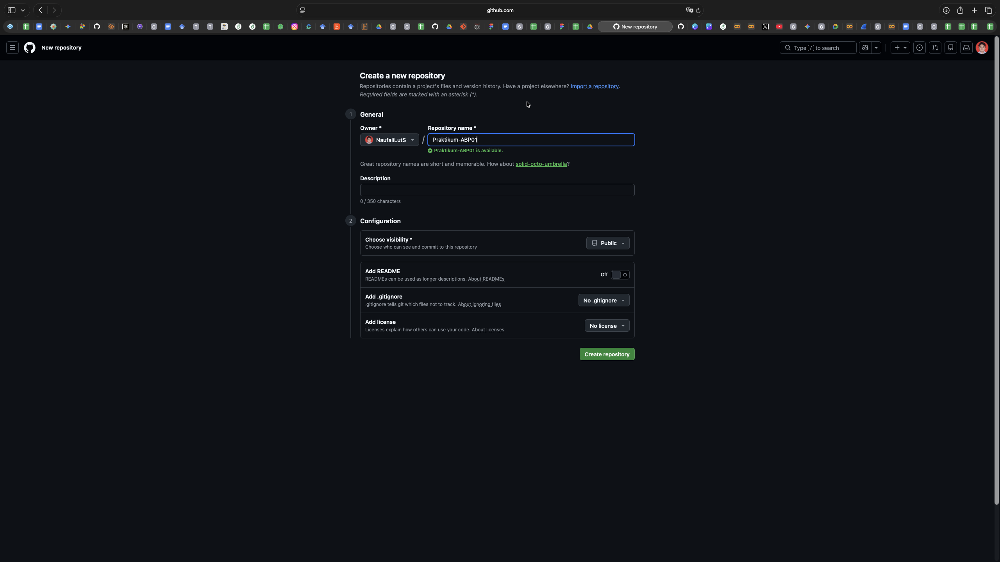
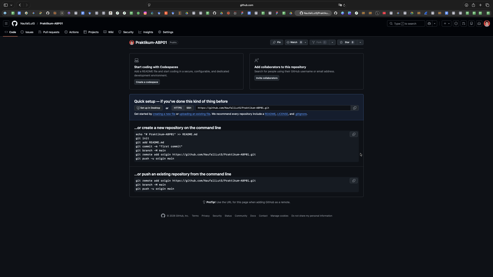
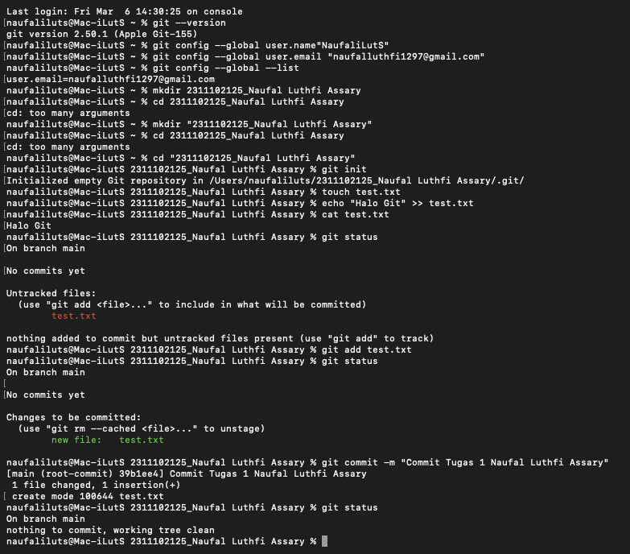
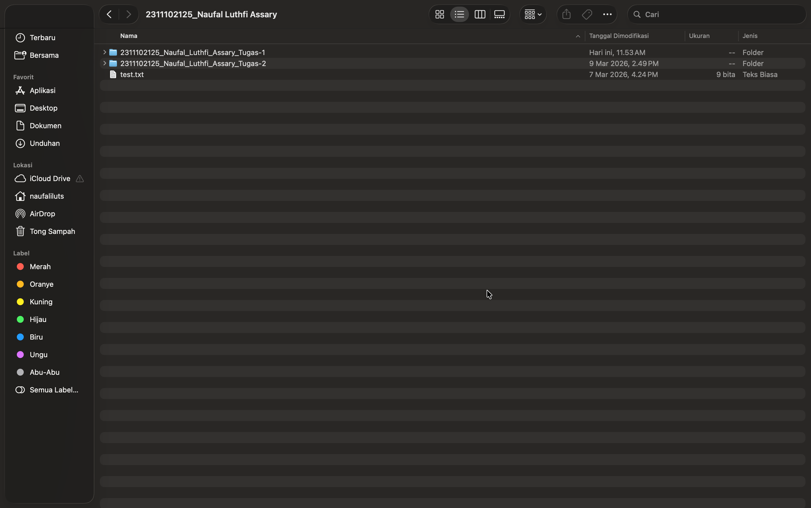
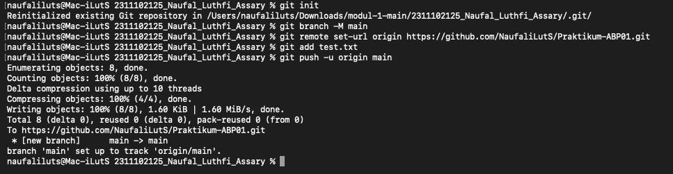
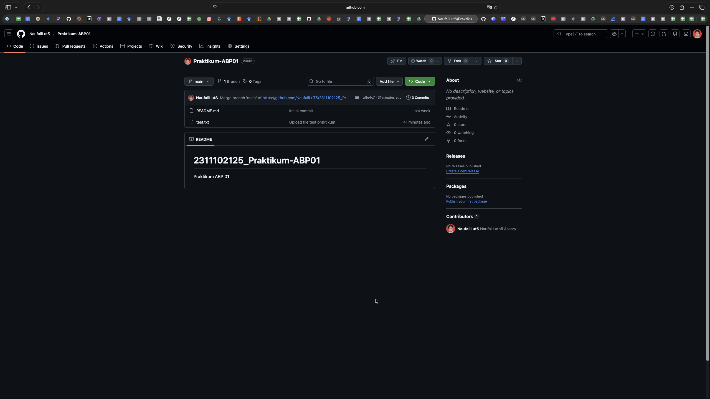

   
  <h1>LAPORAN PRAKTIKUM  APLIKASI BERBASIS PLATFORM</h1>
   
  <h3>MODUL 1   GIT</h3>
   
   
   
   
   
   
   
  <h3>Disusun Oleh :</h3>
  

    <strong>NAUFAL LUTHFI ASSARY</strong> 
    <strong>2311102125</strong> 
    <strong>S1 IF-11-REG01</strong>
  

   
  <h3>Dosen Pengampu :</h3>
  

    <strong>Dimas Fanny Hebrasianto Permadi, S.ST., M.Kom</strong>
  

   
   
    <h4>Asisten Praktikum :</h4>
    <strong> Apri Pandu Wicaksono </strong>  
    <strong>Rangga Pradarrell Fathi</strong>
   
  <h3>LABORATORIUM HIGH PERFORMANCE
  FAKULTAS INFORMATIKA  UNIVERSITAS TELKOM PURWOKERTO  2026</h3>

---

## 1. Dasar Teori

**Git** merupakan sistem pengontrol versi (Version Control System / VCS) yang digunakan untuk mencatat, mengelola, dan melacak setiap perubahan pada file atau proyek perangkat lunak. Git diciptakan oleh Linus Torvalds dan dikenal sebagai distributed version control, yaitu sistem kontrol versi yang memungkinkan salinan basis data repositori dimiliki secara lokal pada tiap komputer pengguna, sehingga pengelolaan versi tidak hanya bergantung pada satu server pusat. Dengan Git, pengembang dapat mengetahui riwayat perubahan file, mengembalikan file ke versi sebelumnya, serta mendukung kerja kolaboratif dalam pengembangan perangkat lunak.  

Dalam penggunaannya, Git bekerja melalui konsep repositori. Repositori adalah tempat penyimpanan seluruh file proyek beserta riwayat perubahannya. Untuk membuat repositori baru secara lokal digunakan perintah git init. Setelah perintah ini dijalankan, Git akan membuat direktori tersembunyi bernama .git yang berfungsi sebagai database untuk menyimpan seluruh catatan perubahan pada proyek. Dengan adanya repositori lokal, setiap perubahan file dapat dipantau dan dikelola dengan lebih terstruktur.  

Setelah repositori dibuat, file yang akan dimasukkan ke dalam pengelolaan Git harus melalui proses staging menggunakan perintah git add. Pada tahap ini, Git menandai file tertentu agar siap disimpan ke dalam riwayat repositori. Sebelum file ditambahkan, Git biasanya menampilkan status file sebagai untracked files, yang berarti file tersebut belum tercatat di dalam repositori. Untuk melihat kondisi file dan status perubahan yang terjadi, digunakan perintah git status. Perintah ini sangat penting karena membantu pengguna mengetahui file mana yang belum dilacak, sedang dipersiapkan, atau sudah tersimpan.  

Setelah file masuk ke area staging, langkah berikutnya adalah melakukan commit dengan perintah git commit -m "pesan commit". Commit merupakan proses penyimpanan perubahan ke dalam riwayat repositori secara permanen. Setiap commit sebaiknya disertai pesan yang jelas agar memudahkan identifikasi perubahan yang telah dilakukan. Dengan demikian, riwayat perkembangan proyek dapat terdokumentasi dengan baik dan memudahkan penelusuran apabila terjadi kesalahan atau diperlukan evaluasi pada versi sebelumnya.  

Selain repositori lokal, Git juga dapat dihubungkan dengan repositori online, salah satunya melalui platform GitHub. GitHub berfungsi sebagai layanan penyimpanan repositori berbasis cloud yang memungkinkan pengguna menyimpan hasil pekerjaan secara daring, membagikan proyek, dan berkolaborasi dengan pengguna lain. Untuk menghubungkan repositori lokal dengan repositori online digunakan perintah git remote add origin [URL repositori]. Setelah itu, data dari komputer lokal dapat dikirimkan ke GitHub menggunakan perintah git push -u origin main atau git push -u origin master, tergantung nama branch yang digunakan. Proses ini memungkinkan file lokal, seperti test.txt, tersimpan di repositori online sehingga dapat diakses kembali dan didokumentasikan sebagai bagian dari hasil praktikum.  

Git juga mendukung proses clone, yaitu menggandakan repositori milik sendiri atau orang lain dari GitHub ke komputer lokal dengan perintah git clone [URL repositori]. Fitur ini sangat berguna dalam kerja tim karena setiap anggota dapat memperoleh salinan proyek yang sama, lalu mengembangkan atau memodifikasi proyek tersebut dari perangkat masing-masing. Dengan demikian, Git tidak hanya bermanfaat untuk penyimpanan versi file, tetapi juga sangat penting dalam mendukung kolaborasi, pengelolaan proyek, dan dokumentasi pengembangan perangkat lunak secara sistematis.

---

## 2. Setup Repository via CLI

Berikut adalah urutan langkah-langkah untuk melakukan inisialisasi dan setup repositori dari lokal ke GitHub melalui CLI:

### Langkah 1: Membuat Repositori Baru di GitHub

Tahap awal yang perlu dilakukan adalah menginisiasi pembuatan repositori pada platform GitHub. Repositori ini berfungsi sebagai media penyimpanan daring (remote) yang tersentralisasi bagi seluruh dokumentasi kode proyek.

### Langkah 2: Panduan Perintah Git

Begitu repositori selesai dibuat, GitHub akan secara otomatis menampilkan daftar instruksi atau perintah (`command`). Perintah-perintah dasar ini perlu dijalankan melalui terminal untuk menghubungkan folder di komputer lokal ke repositori online tersebut. Biasanya, urutan perintah yang digunakan mencakup `git init`, `git add`, `git commit`, `git branch`, `git remote add origin`, hingga `git push`.

### Langkah 3: Membuat Folder Proyek dan File serta Membuka CMD dari Direktori Folder Proyek

  

  

Langkah berikutnya, siapkan folder lokal di komputer Anda. Di dalamnya, buatlah satu file contoh seperti **test.txt** yang nantinya akan berfungsi sebagai konten untuk commit pertama.

Setelah itu, buka Command Prompt (CMD) atau Terminal dan arahkan lokasinya agar tepat berada di dalam folder proyek tersebut. Pastikan path sudah sesuai agar semua perintah Git yang dijalankan mengarah ke direktori yang benar.

### Langkah 4: Menjalankan Perintah Git di Terminal (Push ke GitHub)

  

Pada tahap ini, semua perintah Git dari Langkah 2 dieksekusi secara berurutan:
- `git init` — Untuk mengaktifkan Git di dalam folder lokal.
- `git add .` — Untuk memasukkan semua file ke dalam staging area (siap untuk dicatat).
- `git commit -m "pesan"` — Untuk menyimpan riwayat perubahan dengan memberikan catatan singkat.
- `git branch -M main` — Untuk mengatur agar nama branch utama yang digunakan adalah `main`.
- `git remote add origin <url>` — Untuk menghubungkan folder di komputer dengan repositori di GitHub.
- `git push -u origin main` — Untuk mengirimkan seluruh perubahan kode ke GitHub.

### Langkah 5: Repositori Berhasil Diperbarui

Jika proses `git push` pada langkah sebelumnya berjalan sukses, seluruh file dan folder kini sudah berhasil terunggah ke repositori GitHub dan siap digunakan untuk kolaborasi lebih lanjut.

## Refrensi
- [Materi Modul 1](https://drive.google.com/file/d/1sAJR4AconN_aZjvLF-GTY0DM-e84pL63/view?usp=sharing)