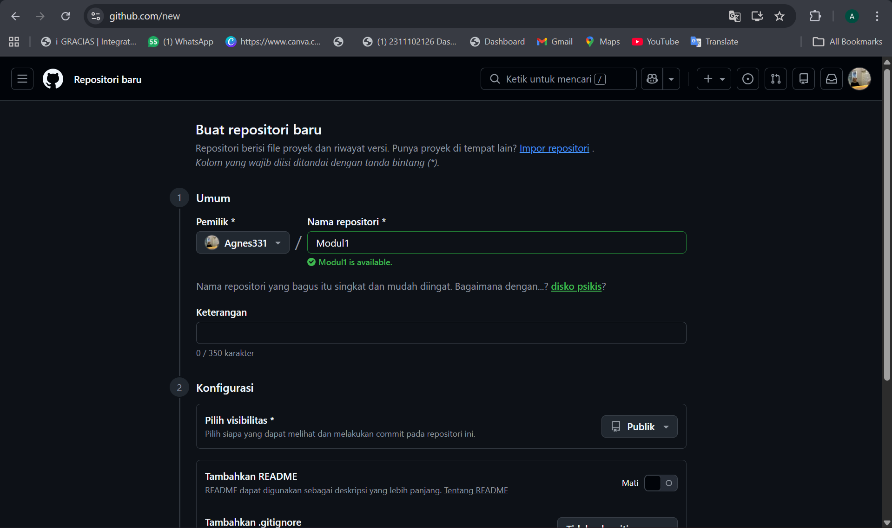
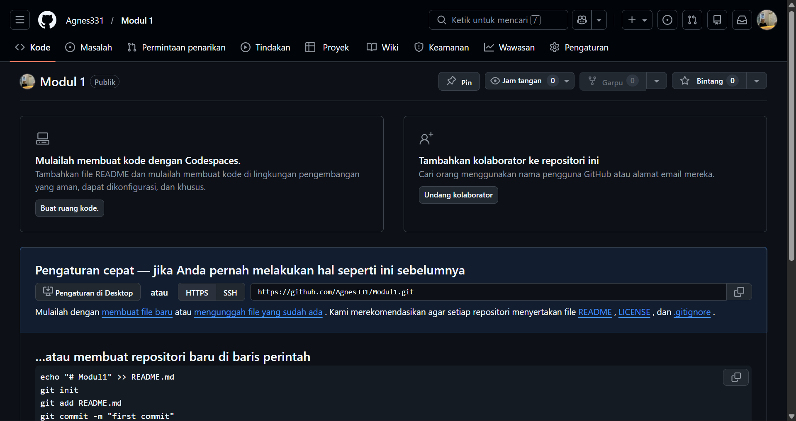
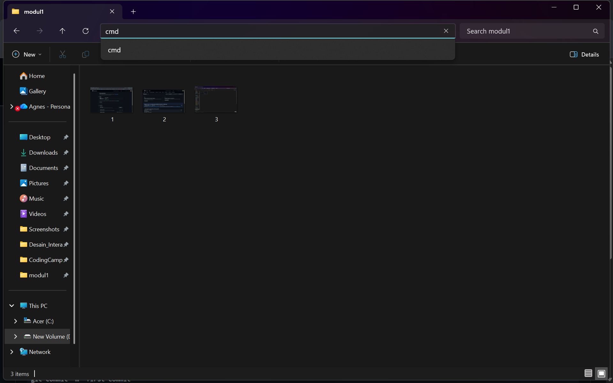
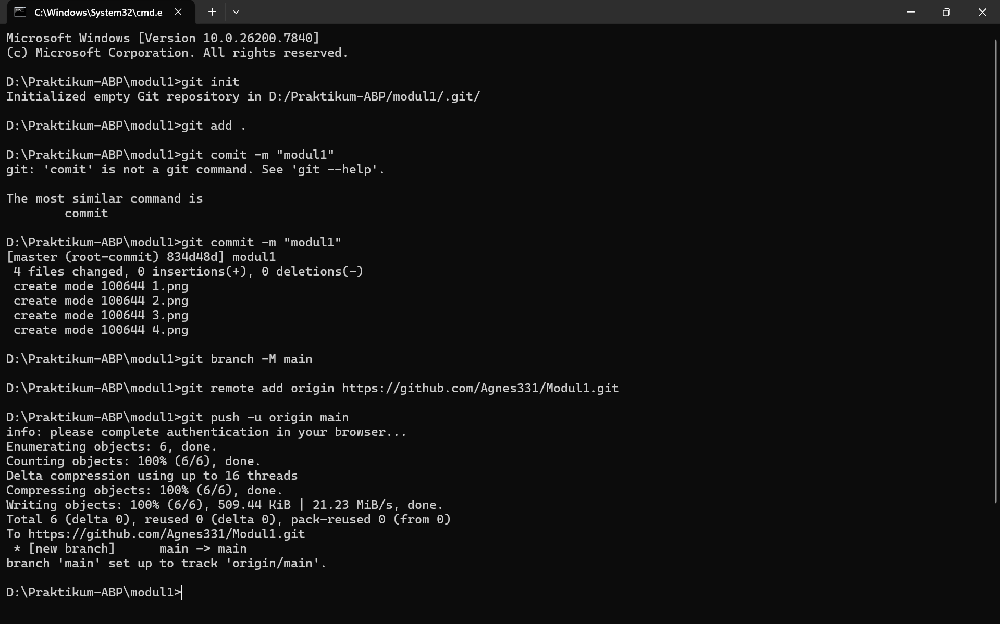
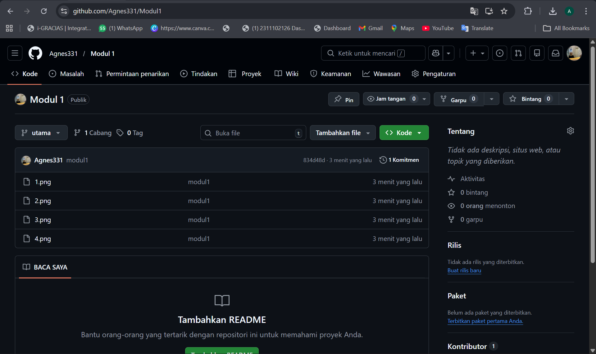

   
  <h1>LAPORAN PRAKTIKUM  APLIKASI BERBASIS PLATFORM</h1>
   
  <h3>MODUL 1   GIT</h3>
   
   
   
   
   
  <h3>Disusun Oleh :</h3>
  

    <strong>Agnes Refilina Fiska</strong> 
    <strong>2311102126</strong> 
    <strong>S1 IF-11-01</strong>
  

   
  <h3>Dosen Pengampu :</h3>
  

    <strong>Dimas Fanny Hebrasianto Permadi, S.ST., M.Kom</strong>
  

   
   
    <h4>Asisten Praktikum :</h4>
    <strong> Apri Pandu Wicaksono </strong>  
    <strong>Rangga Pradarrell Fathi</strong>
   
  <h3>LABORATORIUM HIGH PERFORMANCE
  FAKULTAS INFORMATIKA  UNIVERSITAS TELKOM PURWOKERTO  2026</h3>

---

## 1. Dasar Teori

**Git** adalah sistem pengontrol versi terdistribusi yang sangat membantu bagi pengembang perangkat lunak untuk melacak perubahan riwayat file dan mempermudah kolaborasi kode dan **GitHub** adalah platform layanan hosting berbasis web untuk repositori Git yang memudahkan kita menyimpan proyek di internet.

**Command Line Interface (CLI)** adalah antarmuka teks di mana pengguna dapat mengetikkan perintah langsung untuk berinteraksi dengan sistem komputer. Dalam praktik ini, kami menggunakan CLI, seperti Command Prompt atau Terminal, untuk mengeksekusi perintah Git dengan lebih cepat dan efisien.

---

## 2. Setup Repository via CLI

Untuk memulai dan menyusun repositori dari lokasi ke GitHub dengan menggunakan CLI, berikut adalah prosedur yang harus diikuti:

### Langkah 1: Membuat Repositori Baru di GitHub

Tahap awal yang krusial adalah menginisiasi repositori baru di GitHub. Infrastruktur ini berperan sebagai pusat penyimpanan data berbasis awan yang memfasilitasi aksesibilitas serta manajemen proyek secara daring.

### Langkah 2: Panduan Perintah Git

Setelah berhasil membuat repositori, GitHub akan menyajikan serangkaian instruksi Git yang perlu dijalankan. Kumpulan perintah ini berfungsi sebagai jembatan untuk mensinkronisasikan proyek di direktori lokal dengan repositori daring yang telah disiapkan.

### Langkah 3: Membuat Folder Proyek dan File

Langkah berikutnya melibatkan pembuatan direktori proyek pada penyimpanan lokal. Selanjutnya, seluruh berkas atau aset yang akan diunggah ke repositori perlu dipersiapkan di dalam folder tersebut.
### Langkah 4: Membuka CMD dari Direktori Folder Proyek

Langkah selanjutnya adalah membuka Terminal atau Command Prompt dan melakukan navigasi ke direktori proyek yang relevan. Hal ini krusial agar seluruh instruksi Git tereksekusi tepat pada folder yang dituju.

### Langkah 5: Menjalankan Perintah Git di Terminal (Push ke GitHub)

Sesuai panduan GitHub, mulailah dengan mengeksekusi rangkaian perintah Git. Tahapan ini meliputi inisialisasi repositori lokal melalui git init, pendaftaran berkas dengan git add, dan perekaman perubahan lewat git commit. Terakhir, hubungkan repositori lokal ke server GitHub menggunakan konfigurasi remote sebelum mengunggah seluruh data menggunakan perintah git push.

### Langkah 6: Repositori Berhasil Diperbarui

Periksa kembali remote repository di GitHub guna mengonfirmasi keberhasilan sinkronisasi data. Pastikan seluruh perubahan yang di-push sudah tercatat di dalam struktur folder repositori.

## Refrensi
- [Materi Modul 1](https://drive.google.com/file/d/1sAJR4AconN_aZjvLF-GTY0DM-e84pL63/view?usp=sharing)