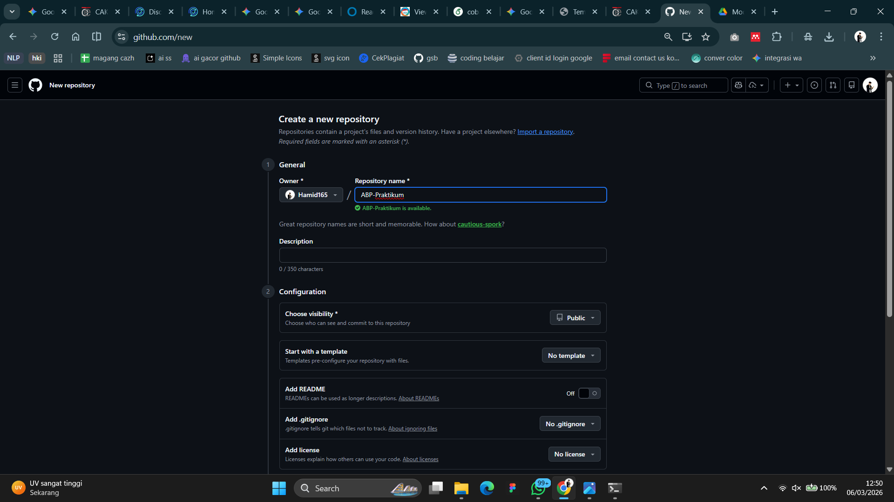
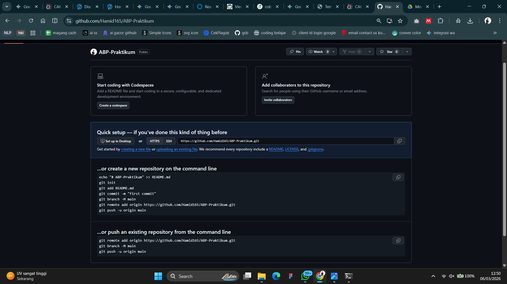
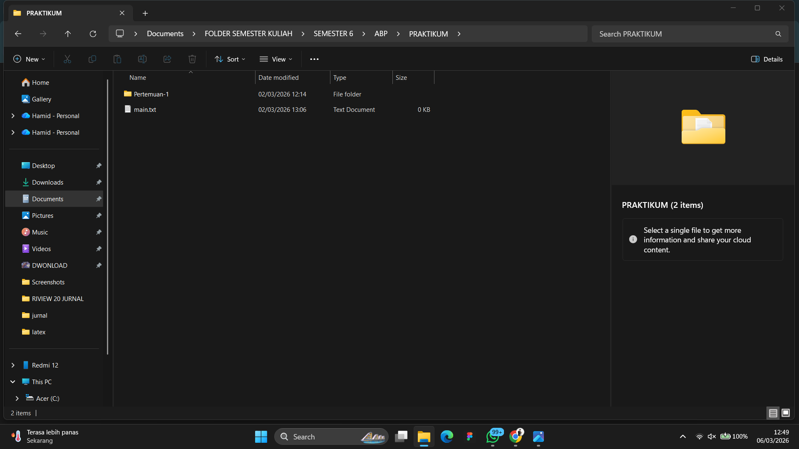
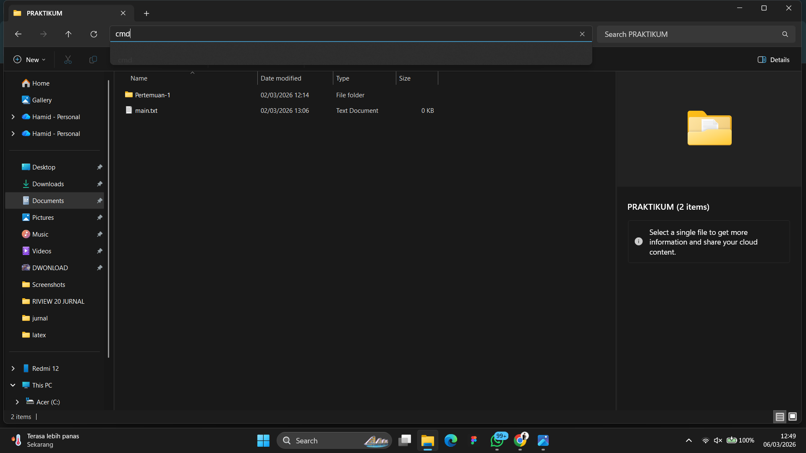
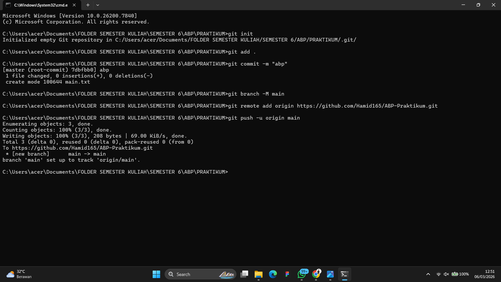
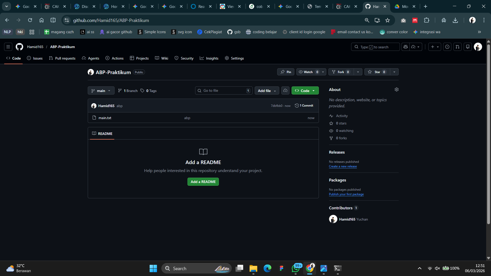

   
  <h1>LAPORAN PRAKTIKUM  APLIKASI BERBASIS PLATFORM</h1>
   
  <h3>MODUL 1   GIT</h3>
   
   
   
   
   
  <h3>Disusun Oleh :</h3>
  

    <strong>HAMID SABIRIN</strong> 
    <strong>2311102129</strong> 
    <strong>S1 IF-11-REG01</strong>
  

   
   
  <h3>Dosen Pengampu :</h3>
  

    <strong>Dimas Fanny Hebrasianto Permadi, S.ST., M.Kom</strong>
  

   
   
    <h4>Asisten Praktikum :</h4>
    <strong> Apri Pandu Wicaksono </strong>  
    <strong>Rangga Pradarrell Fathi</strong>
   
  <h3>LABORATORIUM HIGH PERFORMANCE
  FAKULTAS INFORMATIKA  UNIVERSITAS TELKOM PURWOKERTO  2026</h3>

---

## 1. Dasar Teori

**Git** adalah sistem pengontrol versi (*Version Control System*) terdistribusi yang sangat berguna bagi para pengembang perangkat lunak untuk melacak perubahan riwayat file, berkolaborasi antar tim, serta memungkinkan pengembalian kode ke versi sebelumnya kapan pun dibutuhkan. Sedangkan **GitHub** adalah platform layanan hosting berbasis web untuk repositori Git yang memudahkan kita menyimpan dan berbagi proyek secara online.

**Command Line Interface (CLI)** adalah antarmuka teks di mana pengguna mengetikkan perintah langsung untuk berinteraksi dengan sistem komputer. Dalam praktikum ini, CLI (seperti Command Prompt atau Terminal) digunakan untuk mengeksekusi perintah-perintah Git secara lebih cepat dan efisien.

Beberapa konsep inti Git yang perlu dipahami:

- **Repository (Repo):** Folder proyek yang dikelola Git, berisi seluruh riwayat perubahan file.
- **Commit:** Perintah `git commit` digunakan untuk menyimpan *snapshot* perubahan file ke dalam riwayat Git secara permanen, disertai pesan deskriptif mengenai isi perubahan tersebut.
- **Branch:** Cabang pengembangan yang memungkinkan pekerjaan berlangsung secara paralel tanpa mengganggu kode utama. Cabang utama secara default bernama `main` atau `master`.
- **Remote:** Tautan ke repositori yang berada di server luar (seperti GitHub). Perintah `git remote add origin <url>` digunakan untuk menghubungkan folder lokal ke repositori GitHub.
- **Push & Pull:** `git push` mengunggah commit lokal ke repositori remote, sedangkan `git pull` mengunduh pembaruan terbaru dari remote ke lokal.

---

## 2. Setup Repository via CLI

Berikut adalah urutan langkah-langkah untuk melakukan inisialisasi dan setup repositori dari lokal ke GitHub melalui CLI:

### Langkah 1: Membuat Repositori Baru di GitHub

Langkah pertama yang harus dilakukan adalah membuat repositori atau wadah baru di platform GitHub. Repositori ini nantinya akan bertindak sebagai tempat penyimpanan online (*remote*) untuk kode proyek kita.

### Langkah 2: Panduan Perintah Git

Setelah repositori dibuat, GitHub otomatis menampilkan panduan daftar perintah (`command`) yang diperlukan. Perintah-perintah dasar ini yang nantinya akan dieksekusi di terminal untuk menyambungkan folder lokal komputer ke repositori online. Perintah umumnya meliputi `git init`, `git add`, `git commit`, `git branch`, `git remote add origin`, hingga `git push`.

### Langkah 3: Membuat Folder Proyek dan File

Selanjutnya, siapkan folder lokal di direktori komputer (contohnya menambahkan folder **Pertemuan 1**). Di dalam folder tersebut, buat setidaknya satu file contoh, seperti **main.txt**, yang akan menjadi isi pertama dari commit awal.

### Langkah 4: Membuka CMD dari Direktori Folder Proyek

Buka Command Prompt (CMD) atau Terminal, kemudian arahkan path-nya agar tepat berada di dalam folder proyek yang telah dibuat. Hal ini penting agar semua perintah Git berjalan pada target direktori yang benar.

### Langkah 5: Menjalankan Perintah Git di Terminal (Push ke GitHub)

Pada tahap ini, semua perintah Git dari Langkah 2 dieksekusi secara berurutan:
- `git init` — menginisialisasi Git pada folder lokal.
- `git add .` — menambahkan semua file ke *staging area*.
- `git commit -m "pesan"` — menyimpan snapshot perubahan dengan pesan deskriptif.
- `git branch -M main` — memastikan nama branch utama adalah `main`.
- `git remote add origin <url>` — menghubungkan repo lokal ke GitHub.
- `git push -u origin main` — mengunggah commit ke GitHub.

### Langkah 6: Repositori Berhasil Diperbarui

Jika proses `git push` pada langkah sebelumnya berjalan sukses, seluruh file dan folder kini sudah berhasil terunggah ke repositori GitHub dan siap digunakan untuk kolaborasi lebih lanjut.

## Refrensi
- [Materi Modul 1](https://drive.google.com/file/d/1sAJR4AconN_aZjvLF-GTY0DM-e84pL63/view?usp=sharing)
- [Git Documentation — git-scm.com](https://git-scm.com/doc)
- [GitHub Docs — Getting Started](https://docs.github.com/en/get-started)