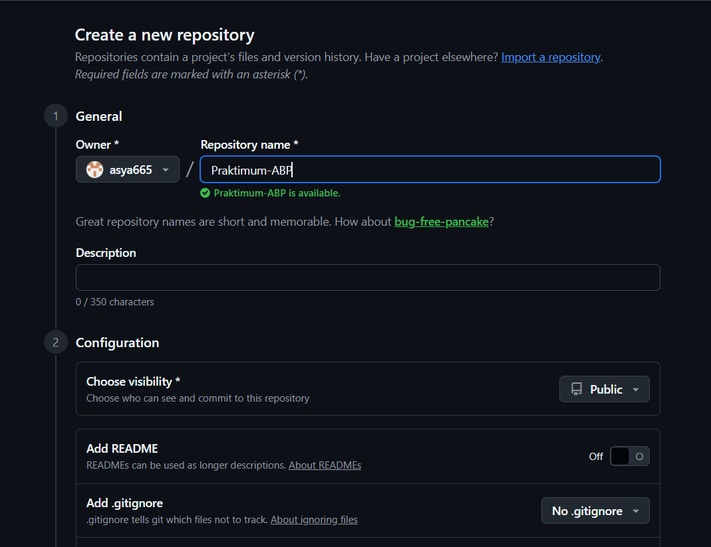
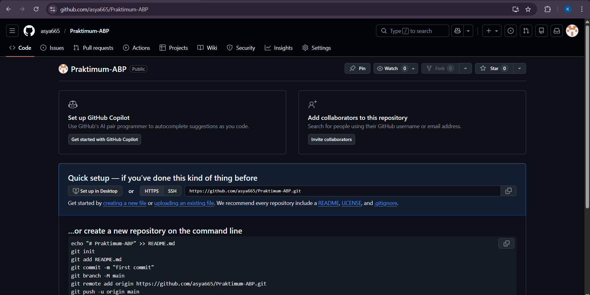
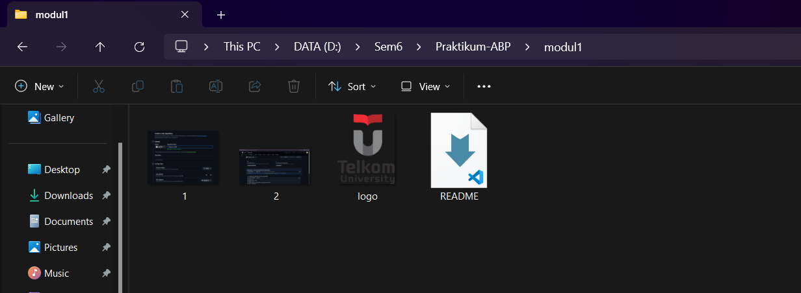
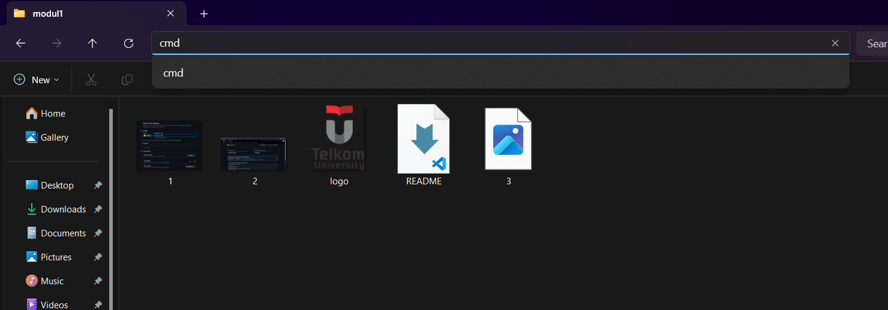
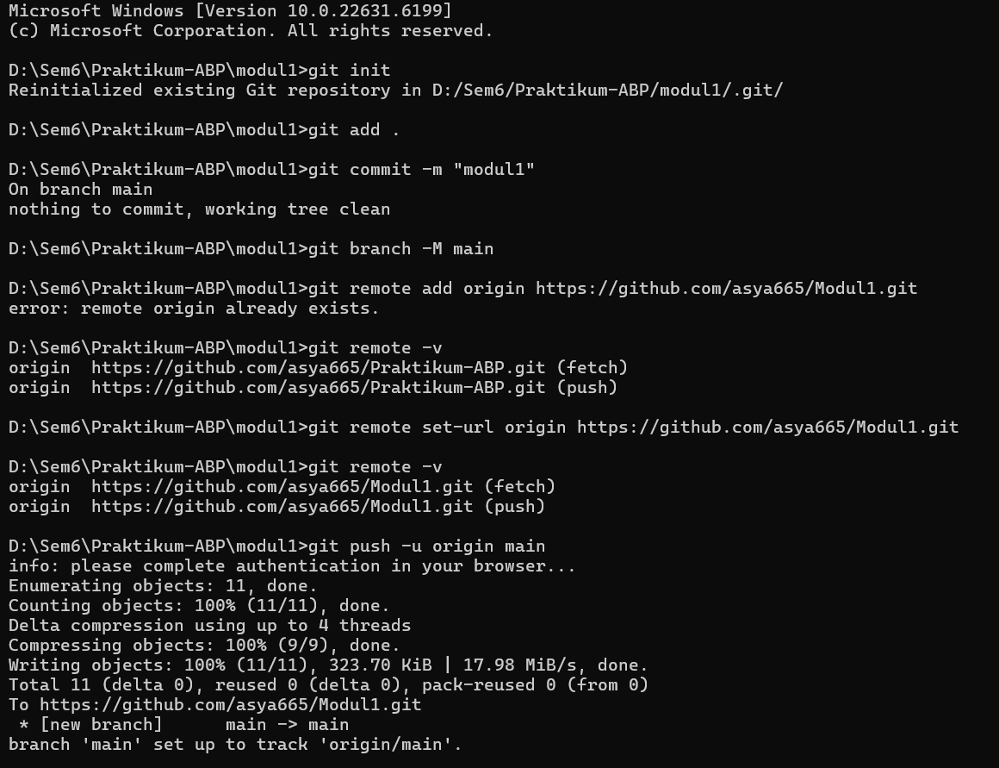
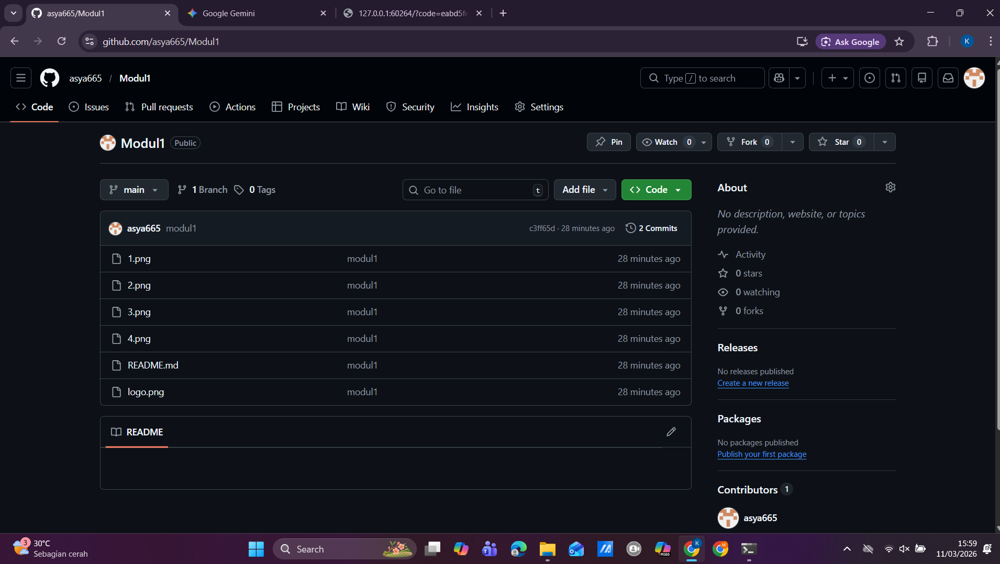

   
  <h1>LAPORAN PRAKTIKUM  APLIKASI BERBASIS PLATFORM</h1>
   
  <h3>MODUL 1   GIT</h3>
   
   
   
   
   
  <h3>Disusun Oleh :</h3>
  

    <strong>Kanasya Abdi Aziz</strong> 
    <strong>2311102140</strong> 
    <strong>S1 IF-11-01</strong>
  

   
  <h3>Dosen Pengampu :</h3>
  

    <strong>Dimas Fanny Hebrasianto Permadi, S.ST., M.Kom</strong>
  

   
   
    <h4>Asisten Praktikum :</h4>
    <strong> Apri Pandu Wicaksono </strong>  
    <strong>Rangga Pradarrell Fathi</strong>
   
  <h3>LABORATORIUM HIGH PERFORMANCE
  FAKULTAS INFORMATIKA  UNIVERSITAS TELKOM PURWOKERTO  2026</h3>

---

## 1. Dasar Teori

**Git** adalah sistem pengontrol versi terdistribusi yang sangat membantu bagi pengembang perangkat lunak untuk melacak perubahan riwayat file dan mempermudah kolaborasi kode dan **GitHub** adalah platform layanan hosting berbasis web untuk repositori Git yang memudahkan kita menyimpan proyek di internet.

**Command Line Interface (CLI)** adalah antarmuka teks di mana pengguna dapat mengetikkan perintah langsung untuk berinteraksi dengan sistem komputer. Dalam praktik ini, kami menggunakan CLI, seperti Command Prompt atau Terminal, untuk mengeksekusi perintah Git dengan lebih cepat dan efisien.

---

## 2. Setup Repository via CLI

Untuk memulai dan menyusun repositori dari lokasi ke GitHub dengan menggunakan CLI, berikut adalah prosedur yang harus diikuti:

### Langkah 1: Membuat Repositori Baru di GitHub

Salah satu langkah pertama yang harus kita lakukan adalah membuat sebuah repositori baru pada platform GitHub. Repositori ini berfungsi sebagai tempat penyimpanan proyek yang dapat diakses, dikelola, dan disimpan secara online.

### Langkah 2: Panduan Perintah Git

GitHub akan menampilkan panduan yang menjelaskan beberapa perintah Git yang harus dilakukan setelah repositori dibuat dengan sukses. Perintah-perintah ini digunakan untuk menghubungkan proyek yang ada di komputer lokal dengan repositori yang telah dibuat di GitHub.

### Langkah 3: Membuat Folder Proyek dan File

Pada tahap ini, kita membuat folder proyek di komputer lokal. Kemudian, kita akan memasukkan item yang akan diunggah ke repositori.
### Langkah 4: Membuka CMD dari Direktori Folder Proyek

Setelah itu, buka Terminal atau Command Prompt (CMD) dan pastikan bahwa direktori yang aktif berada pada folder proyek yang telah dibuat sebelumnya. Hal ini diperlukan untuk memastikan bahwa semua perintah Git yang dijalankan akan diterapkan pada folder proyek yang benar.

### Langkah 5: Menjalankan Perintah Git di Terminal (Push ke GitHub)

Pada tahap ini, ikuti petunjuk yang diberikan oleh GitHub untuk menjalankan perintah-perintah Git. Proses dimulai dengan menggunakan git init untuk menginisialisasi repositori lokal, menambahkan file menggunakan git add, membuat commit menggunakan git commit, menghubungkan repositori lokal dengan repositori GitHub melalui jalur jauh, dan kemudian mengunggah file menggunakan git push.

### Langkah 6: Repositori Berhasil Diperbarui

Cek pada repository di github apakah file yang tadi di push sudah muncul

## Refrensi
- [Materi Modul 1](https://drive.google.com/file/d/1sAJR4AconN_aZjvLF-GTY0DM-e84pL63/view?usp=sharing)