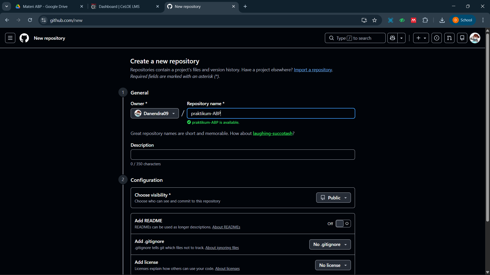
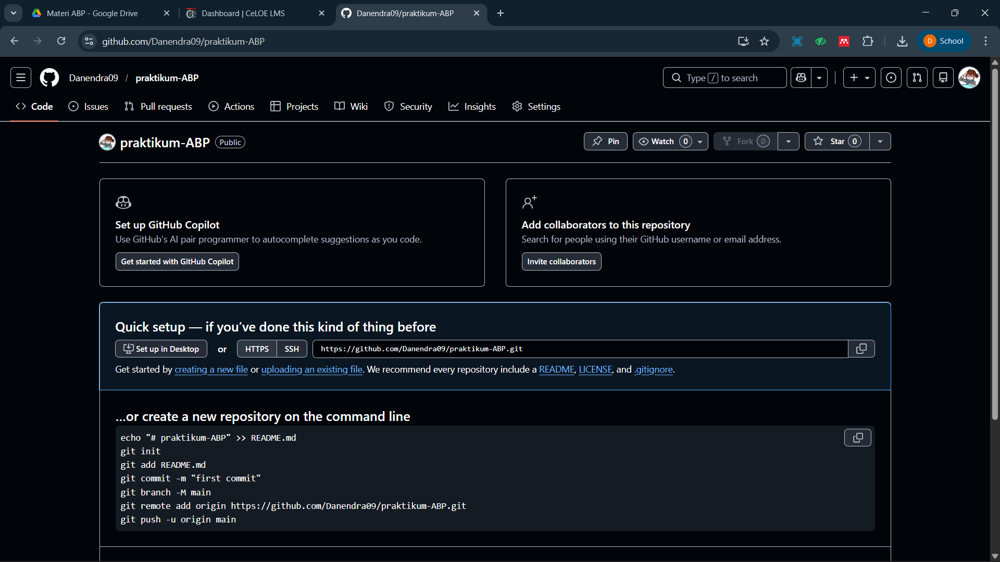
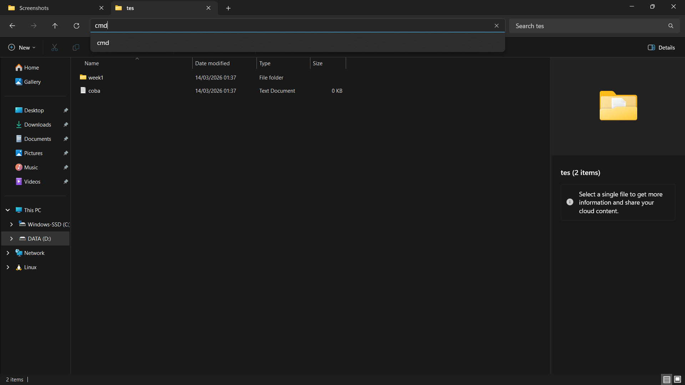
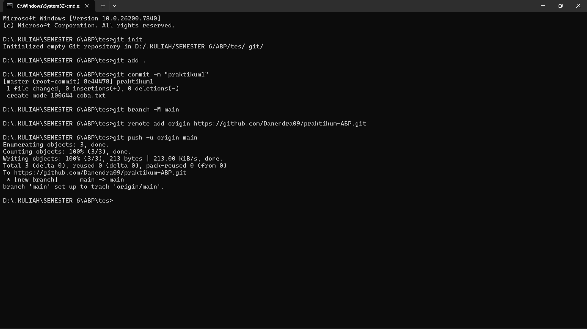
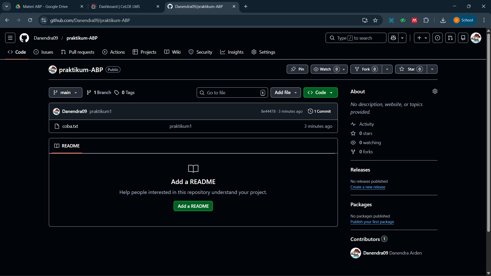

   
  <h1>LAPORAN PRAKTIKUM  APLIKASI BERBASIS PLATFORM</h1>
   
  <h3>MODUL 1   GIT</h3>
   
   
   
   
   
  <h3>Disusun Oleh :</h3>
  

    <strong>DANENDRA ARDEN SHADUQ</strong> 
    <strong>2311102146</strong> 
    <strong>S1 IF-11-REG01</strong>
  

   
   
  <h3>Dosen Pengampu :</h3>
  

    <strong>Dimas Fanny Hebrasianto Permadi, S.ST., M.Kom</strong>
  

   
   
    <h4>Asisten Praktikum :</h4>
    <strong> Apri Pandu Wicaksono </strong>  
    <strong>Rangga Pradarrell Fathi</strong>
   
  <h3>LABORATORIUM HIGH PERFORMANCE
  FAKULTAS INFORMATIKA  UNIVERSITAS TELKOM PURWOKERTO  2026</h3>

---

## 1. Dasar Teori

**Git** adalah salah satu sistem pengontrol versi (Version Control System) pada proyek perangkat lunak yang
diciptakan oleh Linus Torvalds. Pengontrol versi bertugas mencatat setiap perubahan pada file proyek yang
dikerjakan oleh banyak orang maupun sendiri. Git dikenal juga dengan distributed revision control (VCS
terdistribusi), artinya penyimpanan database Git tidak hanya berada dalam satu tempat saja.

Git menggunakan konsep **distributed version control**, yaitu setiap pengguna memiliki salinan lengkap dari repositori beserta riwayat perubahannya di komputer lokal. Dengan pendekatan ini, pekerjaan dapat dilakukan secara offline tanpa harus selalu terhubung dengan server utama. Perubahan yang dilakukan pada file proyek akan direkam dalam bentuk commit, yaitu catatan perubahan yang menyimpan informasi mengenai perubahan file, waktu perubahan, serta penulis perubahan tersebut. Sistem ini membantu pengembang dalam mengelola versi proyek secara lebih terstruktur dan meminimalkan konflik ketika beberapa orang bekerja pada proyek yang sama.

Dalam penggunaan Git, terdapat beberapa konsep penting seperti **repository**, **commit**, **branch**, dan **clone**. Repository merupakan tempat penyimpanan seluruh file proyek beserta riwayat perubahannya. Commit digunakan untuk menyimpan perubahan yang telah dilakukan pada proyek. Branch memungkinkan pengembang membuat cabang pengembangan baru tanpa mengganggu kode utama, sedangkan clone digunakan untuk menyalin repositori dari server atau dari pengguna lain ke komputer lokal. Melalui mekanisme tersebut, Git mempermudah proses pengembangan perangkat lunak secara kolaboratif, menjaga konsistensi kode, serta meningkatkan efisiensi dalam pengelolaan proyek perangkat lunak.

---

## 2. Setup Repository via CLI

Berikut adalah urutan langkah-langkah untuk melakukan inisialisasi dan setup repositori dari lokal ke GitHub melalui CLI:

### Langkah 1: Membuat Repositori Baru di GitHub

Tahap awal yang perlu dilakukan adalah menginisiasi pembuatan repositori pada platform GitHub. Repositori ini berfungsi sebagai media penyimpanan daring (remote) yang tersentralisasi bagi seluruh dokumentasi kode proyek.

### Langkah 2: Panduan Perintah Git

Begitu repositori selesai dibuat, GitHub akan secara otomatis menampilkan daftar instruksi atau perintah (`command`). Perintah-perintah dasar ini perlu dijalankan melalui terminal untuk menghubungkan folder di komputer lokal ke repositori online tersebut. Biasanya, urutan perintah yang digunakan mencakup `git init`, `git add`, `git commit`, `git branch`, `git remote add origin`, hingga `git push`.

### Langkah 3: Membuat Folder Proyek dan File serta Membuka CMD dari Direktori Folder Proyek

Langkah berikutnya, siapkan folder lokal di komputer Anda (misalnya folder **Pertemuan 1**). Di dalamnya, buatlah satu file contoh seperti **coba.txt** yang nantinya akan berfungsi sebagai konten untuk commit pertama.

Setelah itu, buka Command Prompt (CMD) atau Terminal dan arahkan lokasinya agar tepat berada di dalam folder proyek tersebut. Pastikan path sudah sesuai agar semua perintah Git yang dijalankan mengarah ke direktori yang benar.

### Langkah 4: Menjalankan Perintah Git di Terminal (Push ke GitHub)

Pada tahap ini, semua perintah Git dari Langkah 2 dieksekusi secara berurutan:
- `git init` — Untuk mengaktifkan Git di dalam folder lokal.
- `git add .` — Untuk memasukkan semua file ke dalam staging area (siap untuk dicatat).
- `git commit -m "pesan"` — Untuk menyimpan riwayat perubahan dengan memberikan catatan singkat.
- `git branch -M main` — Untuk mengatur agar nama branch utama yang digunakan adalah `main`.
- `git remote add origin <url>` — Untuk menghubungkan folder di komputer dengan repositori di GitHub.
- `git push -u origin main` — Untuk mengirimkan seluruh perubahan kode ke GitHub.

### Langkah 5: Repositori Berhasil Diperbarui

Jika proses `git push` pada langkah sebelumnya berjalan sukses, seluruh file dan folder kini sudah berhasil terunggah ke repositori GitHub dan siap digunakan untuk kolaborasi lebih lanjut.

## Refrensi
- [Materi Modul 1](https://drive.google.com/file/d/1sAJR4AconN_aZjvLF-GTY0DM-e84pL63/view?usp=sharing)