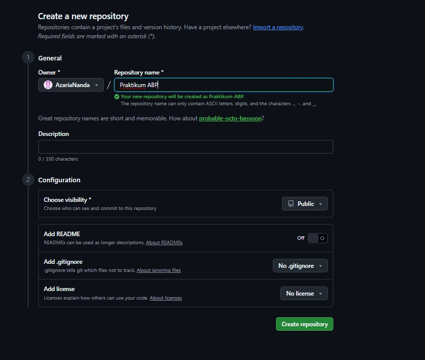
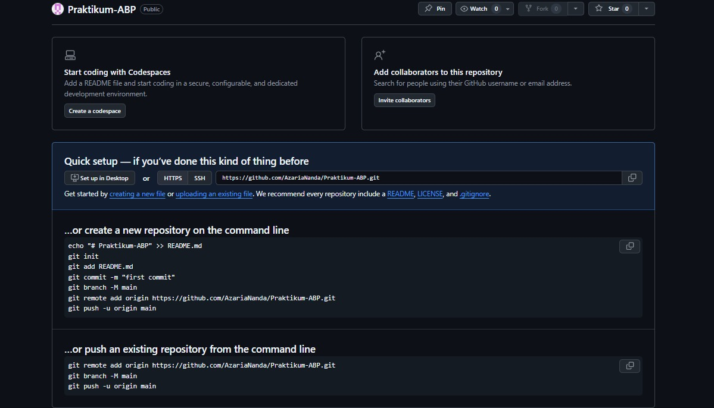
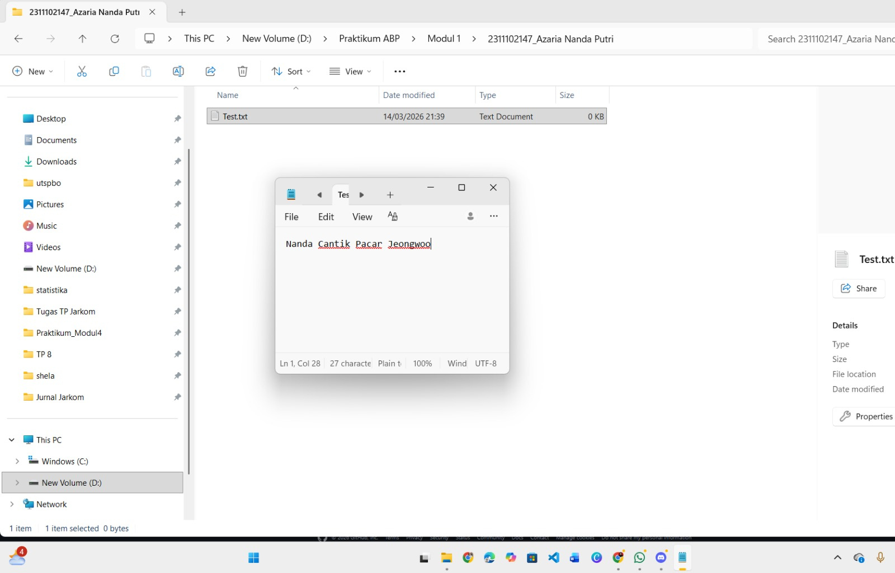
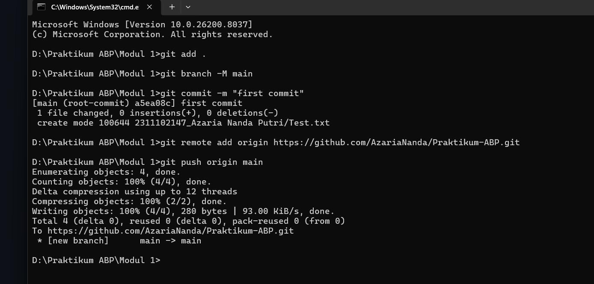

   
  <h1>LAPORAN PRAKTIKUM  APLIKASI BERBASIS PLATFORM</h1>
   
  <h2>MODUL 1  GIT</h2>
   
   
   
   
   
   
  <h3>Disusun Oleh :</h3>
  

    <strong>Azaria Nanda Putri</strong> 
    <strong>2311102147</strong> 
    <strong>S1 IF-11-REG 01</strong>
  

   
  <h3>Dosen Pengampu :</h3>
  

    <strong>Dimas Fanny Hebrasianto Permadi, S.ST., M.Kom</strong>
  

   
   
    <h4>Asisten Praktikum :</h4>
    <strong> Apri Pandu Wicaksono </strong>  
    <strong>Rangga Pradarrell Fathi</strong>
   
  <h2>LABORATORIUM HIGH PERFORMANCE
  FAKULTAS INFORMATIKA  UNIVERSITAS TELKOM PURWOKERTO  2026</h2>

---

# 1. Dasar Teori

## Pengenalan Git sebagai Sistem Pengelola Versi

Git merupakan sebuah Version Control System (VCS) yang dikembangkan oleh Linus Torvalds dan banyak digunakan dalam proses pengembangan perangkat lunak. Sistem ini berfungsi untuk membantu pengembang dalam mengelola serta mencatat setiap perubahan yang terjadi pada suatu proyek.

Secara umum, Git memiliki beberapa fungsi utama sebagai berikut:

- **Mencatat Riwayat Perubahan**  
  Git mampu merekam setiap perubahan yang dilakukan pada kode program maupun dokumen dalam suatu proyek. Dengan adanya riwayat tersebut, pengembang dapat mengetahui perubahan yang pernah dilakukan serta memudahkan proses pengelolaan proyek baik secara individu maupun tim.

- **Menggunakan Sistem Terdistribusi**  
  Berbeda dengan sistem pengontrol versi lama yang bersifat terpusat, Git menggunakan konsep distribusi dalam penyimpanan datanya.

---

# 2. Setup Repository melalui CLI

Bagian ini menjelaskan langkah-langkah untuk membuat serta mengonfigurasi repository dari komputer lokal agar dapat terhubung dengan repository di GitHub menggunakan **Command Line Interface (CLI)**.

### Apa yang dimaksud dengan sistem terdistribusi?

Dalam Git, data yang berisi riwayat versi proyek tidak hanya disimpan pada satu server pusat. Setiap pengembang memiliki salinan lengkap repository beserta seluruh riwayat perubahannya pada komputer masing-masing. Hal ini membuat proses pengembangan menjadi lebih fleksibel serta tidak bergantung pada satu server saja.

---
---

## Langkah 1: Membuat Repository Baru di GitHub

Langkah pertama adalah membuat repository baru melalui platform GitHub. Repository ini berfungsi sebagai tempat penyimpanan proyek secara daring sehingga kode program dapat disimpan, dikelola, dan dibagikan dengan lebih mudah.

---

## Langkah 2: Melihat Panduan Perintah Git

Setelah repository berhasil dibuat, GitHub akan menampilkan beberapa perintah Git yang dapat digunakan untuk menghubungkan folder proyek yang ada di komputer lokal dengan repository tersebut.

---

## Langkah 3: Menyiapkan Folder Proyek dan File Awal

Langkah selanjutnya adalah membuat folder proyek pada komputer, misalnya dengan nama:

Modul 1/2311102147_Azaria Nanda Putri

Di dalam folder tersebut dapat dibuat file awal seperti `test.txt` sebagai contoh isi repository. Selain itu, pengguna juga dapat menambahkan file lain yang diperlukan sesuai kebutuhan proyek.

---

## Langkah 4: Membuka Terminal pada Folder Proyek

Buka **Command Prompt (CMD)** atau terminal pada sistem operasi yang digunakan. Setelah itu arahkan direktori menuju folder proyek yang telah dibuat sebelumnya agar setiap perintah Git dapat dijalankan pada direktori tersebut.

---

## Langkah 5: Menjalankan Perintah Git (Push ke GitHub)

Pada tahap ini, jalankan perintah Git sesuai dengan panduan yang diberikan oleh GitHub secara berurutan melalui terminal. Proses yang dilakukan meliputi:

- Menginisialisasi repository Git pada folder lokal dengan perintah `git init`
- Menambahkan file ke dalam *staging area* menggunakan `git add`
- Menyimpan perubahan sebagai riwayat lokal dengan `git commit`
- Menghubungkan repository lokal dengan repository remote di GitHub
- Mengunggah file dan riwayat perubahan ke GitHub menggunakan `git push`

---

## Langkah 6: Repository Berhasil Diperbarui

Apabila proses *push* berhasil dilakukan tanpa muncul pesan kesalahan, maka seluruh file dan struktur folder yang sebelumnya berada di komputer lokal akan tersimpan di repository GitHub. Dengan demikian, proyek tersebut sudah dapat diakses secara daring dan memungkinkan untuk dikembangkan secara kolaboratif.

---

### Refrensi

- [Materi Modul 1](https://drive.google.com/file/d/1v2HYQXoUcKedERxtmi9eJqeZ1MsQZ5T4/view?usp=drive_link)