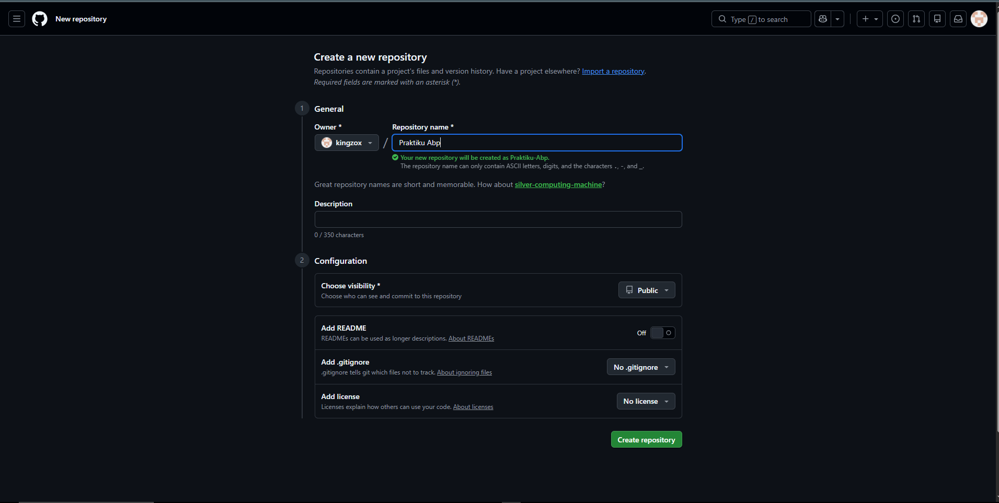
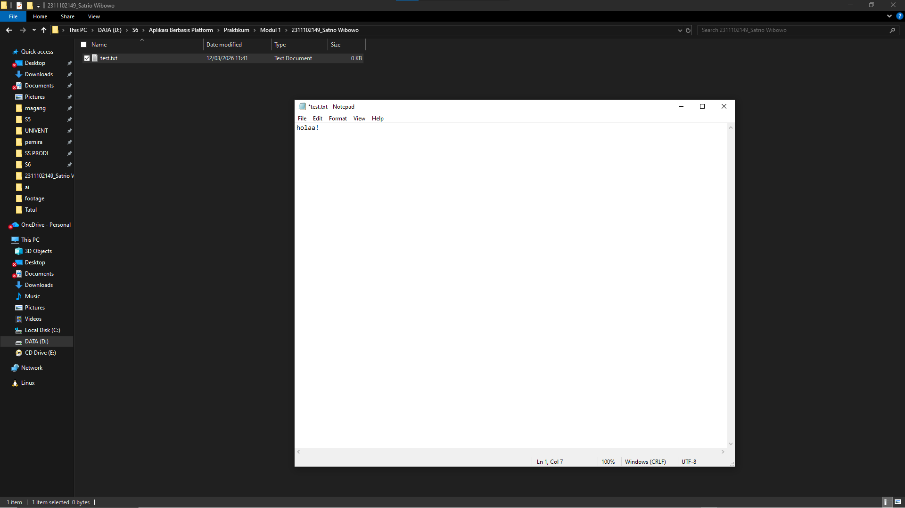
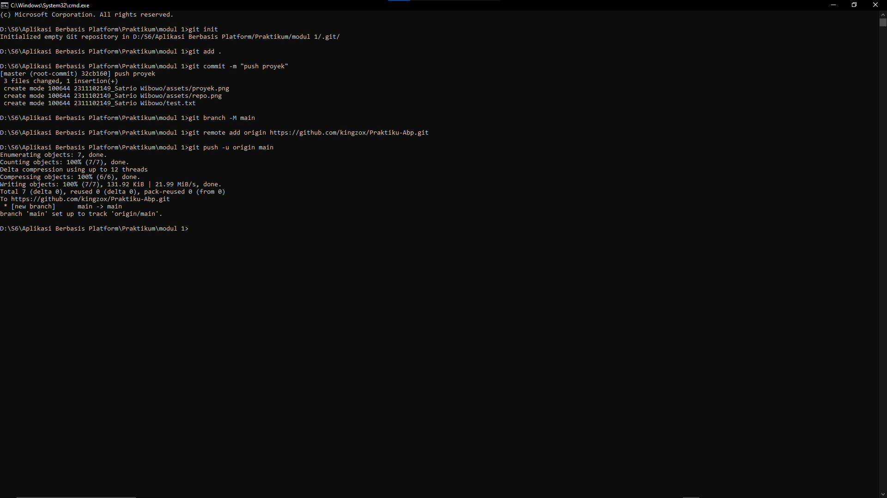
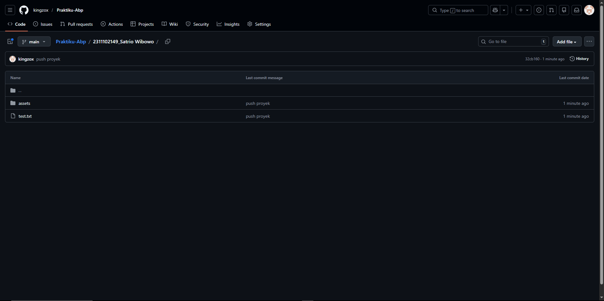

   
  <h1>LAPORAN PRAKTIKUM  APLIKASI BERBASIS PLATFORM</h1>
   
  <h2>MODUL 1  GIT</h2>
   
   
   
   
   
   
  <h3>Disusun Oleh :</h3>
  

    <strong>Satrio Wibowo</strong> 
    <strong>2311102149</strong> 
    <strong>S1 IF-11-REG 01</strong>
  

   
  <h3>Dosen Pengampu :</h3>
  

    <strong>Dimas Fanny Hebrasianto Permadi, S.ST., M.Kom</strong>
  

   
   
    <h4>Asisten Praktikum :</h4>
    <strong> Apri Pandu Wicaksono </strong>  
    <strong>Rangga Pradarrell Fathi</strong>
   
  <h2>LABORATORIUM HIGH PERFORMANCE
  FAKULTAS INFORMATIKA  UNIVERSITAS TELKOM PURWOKERTO  2026</h2>

---

# 1. Dasar Teori

### Mengenal Git: Sistem Pengontrol Versi Terdistribusi

Git adalah sebuah Sistem Pengontrol Versi (Version Control System/VCS) rancangan Linus Torvalds yang kini menjadi standar utama dalam dunia pengembangan perangkat lunak.

Secara garis besar, Git memiliki fungsi dan karakteristik sebagai berikut:

- **Perekam Jejak Perubahan**: Fungsi utama Git adalah memantau dan mencatat setiap modifikasi yang terjadi pada kode atau dokumen suatu proyek. Hal ini sangat memudahkan pengelolaan proyek, baik ketika dikerjakan sendirian (solo) maupun saat berkolaborasi dalam tim.
- **Sistem Terdistribusi (Distributed VCS)**: Berbeda dengan sistem lawas yang terpusat, Git beroperasi secara terdistribusi.

---

# 2. Setup Repository via CLI

Di bawah ini langkah-langkah menginisiasi serta mengonfigurasi repositori dari perangkat lokal agar terhubung ke GitHub dengan menggunakan **Command Line Interface (CLI)**.

**Apa maksud dari "Terdistribusi"?**  
Dalam sistem Git, basis data yang berisi riwayat versi proyek tidak hanya disimpan di satu server pusat. Sebaliknya, setiap pengembang (developer) memiliki salinan basis data dan riwayat kode yang sepenuhnya utuh di komputer mereka masing-masing. Hal ini membuat proses pengembangan menjadi lebih cepat, aman, dan fleksibel.

---

## Langkah 1: Pembuatan Repositori Baru di GitHub

Tahap pertama dilakukan dengan membuat repositori baru melalui **platform GitHub**. Repositori tersebut berfungsi sebagai tempat penyimpanan proyek berbasis cloud, sehingga kode program yang dikembangkan dapat dikelola serta dibagikan dengan lebih mudah dan efisien.

---

## Langkah 2: Panduan Perintah Dasar Git

Setelah repositori berhasil dibuat, antarmuka GitHub secara otomatis menampilkan panduan berupa kumpulan perintah Git. Perintah-perintah tersebut menjadi instruksi penting untuk menghubungkan folder proyek yang berada di penyimpanan lokal komputer dengan repositori daring di GitHub.

---

## Langkah 3: Penyiapan Folder Proyek dan File Awal

Langkah berikutnya adalah menyiapkan direktori proyek pada komputer, misalnya dengan membuat folder bernama modul 1/2311102149_Satrio Wibowo. Di dalam folder tersebut, buat minimal satu file contoh seperti test.txt sebagai isi awal repositori. Selain itu, Anda juga dapat menambahkan file lain yang diperlukan untuk mendukung proyek tersebut.

---

## Langkah 4: Membuka Terminal dari Direktori Proyek

Buka **Command Prompt (CMD)** atau terminal pada sistem operasi yang digunakan, kemudian arahkan direktori menuju folder proyek yang telah dibuat. Langkah ini perlu dilakukan agar setiap perintah Git yang dijalankan nantinya dapat diterapkan langsung pada folder proyek tersebut.

---

## Langkah 5: Eksekusi Perintah Git (Proses Push ke GitHub)

Pada tahap ini, jalankan instruksi Git yang telah diberikan oleh GitHub sebelumnya secara berurutan di dalam terminal. Rangkaian alur kerjanya meliputi:

- Menginisialisasi pelacakan Git pada direktori lokal (`git init`)
- Memasukkan perubahan file ke dalam *staging area* (`git add`)
- Menyimpan riwayat perubahan secara permanen di lokal (`git commit`)
- Menautkan repositori lokal ke repositori *remote* GitHub
- Mengunggah kumpulan file dan riwayat tersebut ke GitHub (`git push`)

---

## Langkah 6: Pembaruan Repositori Berhasil

Apabila proses *push* berhasil dilakukan tanpa muncul pesan error, maka seluruh file beserta struktur folder yang sebelumnya hanya tersimpan di perangkat lokal akan otomatis tersimpan di repositori GitHub. Dengan demikian, proyek tersebut sudah dapat diakses serta dikembangkan lebih lanjut secara kolaboratif.

### Refrensi

- [Materi Modul 1](https://drive.google.com/file/d/1v2HYQXoUcKedERxtmi9eJqeZ1MsQZ5T4/view?usp=drive_link)