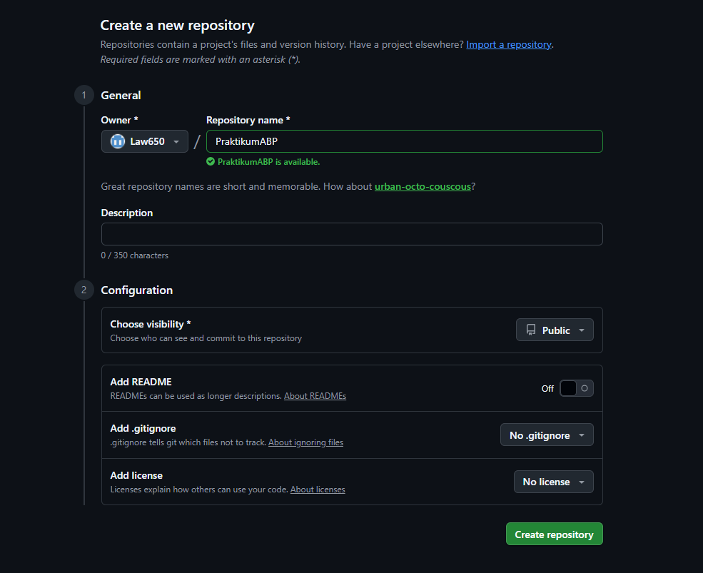
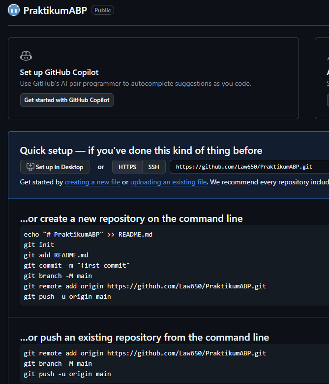
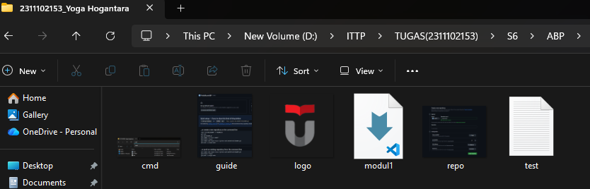
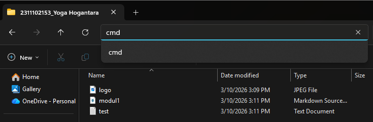
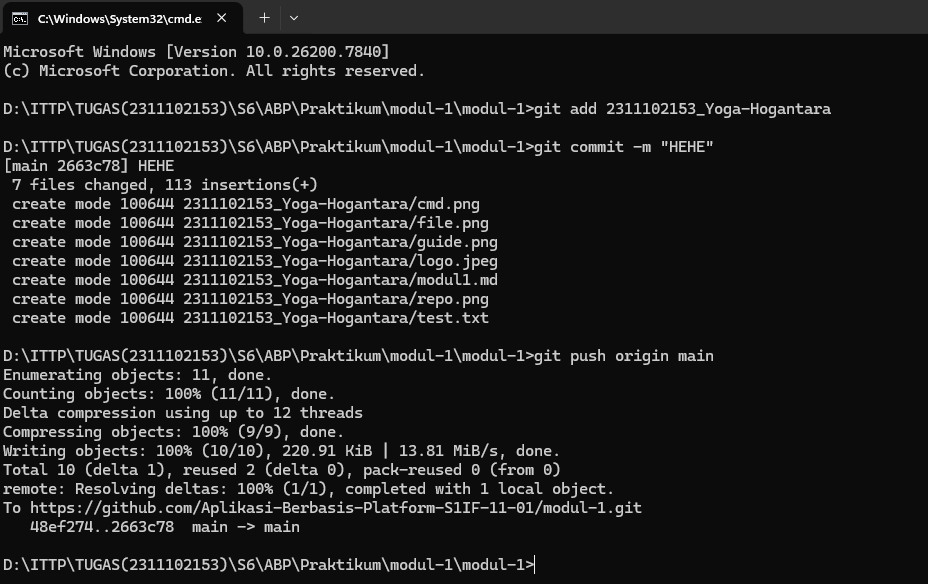
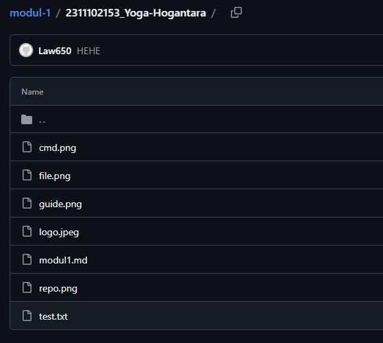

 

# LAPORAN PRAKTIKUM  
# APLIKASI BERBASIS PLATFORM

 

## MODUL 1  
## GIT

 

  

### Disusun Oleh

**Yoga Hogantara**  
**2311102153**  
**S1 IF-11-REG01**

 

### Dosen Pengampu

**Dimas Fanny Hebrasianto Permadi, S.ST., M.Kom**

 

### Asisten Praktikum

**Apri Pandu Wicaksono**  
**Rangga Pradarrell Fathi**

  

### LABORATORIUM HIGH PERFORMANCE  
### FAKULTAS INFORMATIKA  
### UNIVERSITAS TELKOM PURWOKERTO  
### 2026

---

# 1. Dasar Teori

Git adalah sebuah sistem pengontrol versi (**Version Control System**) ciptaan **Linus Torvalds** yang sangat umum digunakan dalam rekayasa perangkat lunak. Fungsi utamanya adalah untuk melacak dan merekam segala modifikasi pada dokumen atau kode proyek, baik untuk pengerjaan secara mandiri maupun kolaborasi tim.

Git juga termasuk dalam kategori **Distributed Version Control System** (sistem kontrol versi terdistribusi). Artinya, basis data penyimpanan riwayat versi tidak hanya terpusat di satu server utama, melainkan salinannya terdistribusi secara lengkap di perangkat masing-masing pengembang.

---

# 2. Setup Repository via CLI

Di bawah ini langkah-langkah menginisiasi serta mengonfigurasi repositori dari perangkat lokal agar terhubung ke GitHub dengan menggunakan **Command Line Interface (CLI)**.

---

## Langkah 1: Pembuatan Repositori Baru di GitHub

Tahap awal adalah membuat sebuah repositori baru melalui platform **GitHub**. Repositori ini nantinya akan berfungsi sebagai wadah penyimpanan proyek berbasis *cloud*, sehingga baris kode yang dikembangkan dapat dikelola dan dibagikan secara lebih praktis.

---

## Langkah 2: Panduan Perintah Dasar Git

Setelah repositori sukses dibuat, antarmuka GitHub otomatis akan menyajikan panduan berupa sekumpulan perintah Git. Perintah-perintah ini menjadi instruksi krusial yang digunakan untuk menautkan folder proyek di memori lokal komputer Anda dengan repositori *online* di GitHub.

---

## Langkah 3: Penyiapan Folder Proyek dan File Awal

Langkah selanjutnya adalah menyiapkan direktori proyek pada komputer Anda, misalnya dengan membuat folder bernama **Modul_1**. Di dalam folder tersebut, buatlah setidaknya satu file contoh (seperti **test.txt**) sebagai konten awal repositori. Anda juga dipersilakan menambahkan file-file lain yang dibutuhkan oleh proyek tersebut.

---

## Langkah 4: Membuka Terminal dari Direktori Proyek

Buka **Command Prompt (CMD)** atau terminal bawaan di sistem operasi Anda, lalu arahkan *path* atau direktorinya menuju folder proyek yang baru saja dibuat. Langkah ini wajib dilakukan agar seluruh instruksi Git yang dieksekusi nantinya tepat sasaran pada folder yang dimaksud.

---

## Langkah 5: Eksekusi Perintah Git (Proses Push ke GitHub)

Pada tahap ini, jalankan instruksi Git yang telah diberikan oleh GitHub sebelumnya secara berurutan di dalam terminal. Rangkaian alur kerjanya meliputi:

- Menginisialisasi pelacakan Git pada direktori lokal (`git init`)
- Memasukkan perubahan file ke dalam *staging area* (`git add`)
- Menyimpan riwayat perubahan secara permanen di lokal (`git commit`)
- Menautkan repositori lokal ke repositori *remote* GitHub
- Mengunggah kumpulan file dan riwayat tersebut ke GitHub (`git push`)

---

## Langkah 6: Pembaruan Repositori Berhasil

Jika proses *push* berjalan sukses tanpa adanya pesan *error*, seluruh file dan struktur folder yang tadinya hanya berada di perangkat lokal kini otomatis tersimpan di repositori GitHub. Dengan demikian, proyek sudah siap untuk diakses dan dikembangkan lebih lanjut secara bersama-sama.

