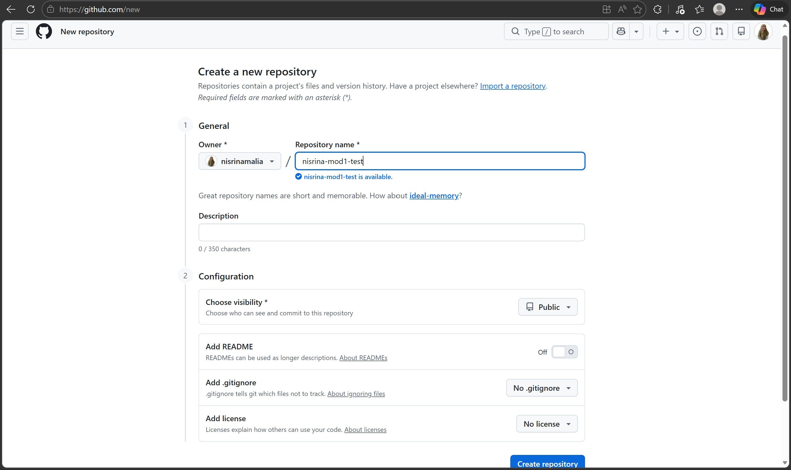
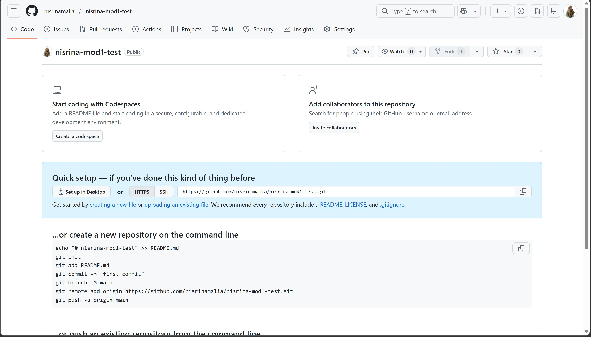
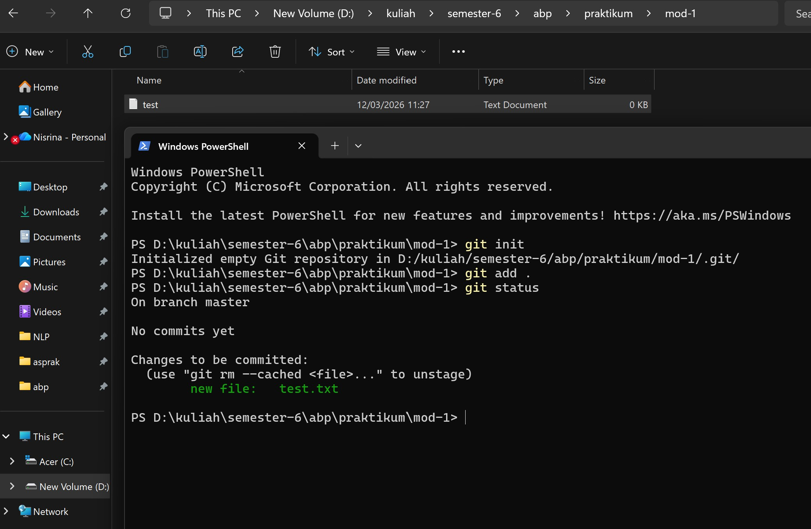
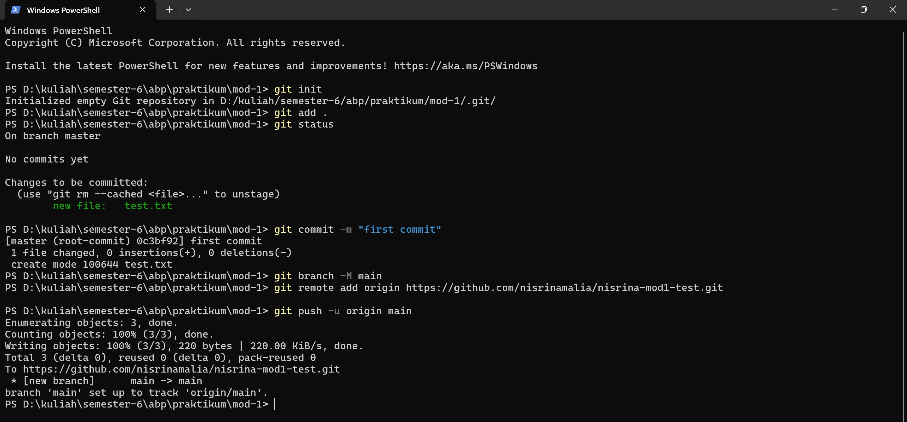
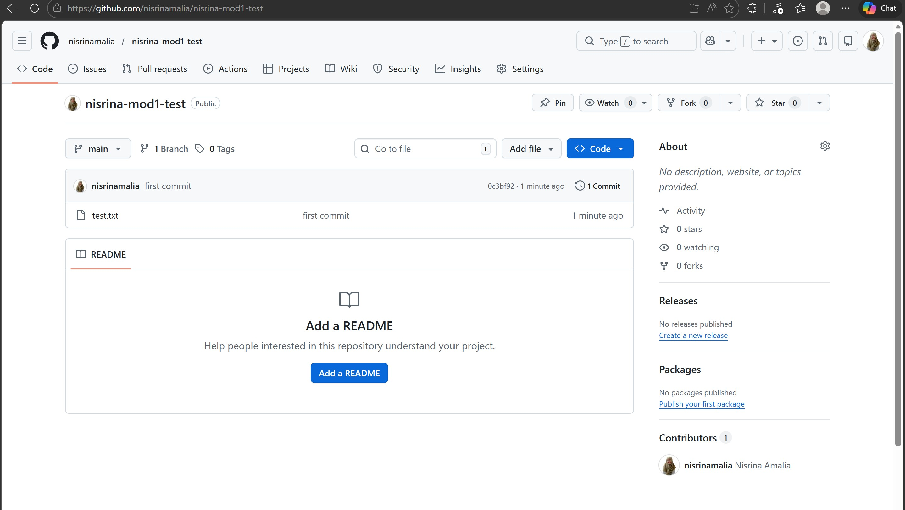

<div align="center">
  <br />
  <h1>LAPORAN PRAKTIKUM <br>APLIKASI BERBASIS PLATFORM</h1>
  <br />
  <h3>MODUL 1 <br> GIT</h3>
  <br />
   
  <br />
  <br />
  <br />
  <h3>Disusun Oleh :</h3>
  <p>
    <strong>Nisrina Amalia Iffatunnisa</strong><br>
    <strong>2311102156</strong><br>
    <strong>S1 IF-11-01</strong>
  </p>
  <br />
  <h3>Dosen Pengampu :</h3>
  <p>
    <strong>Dimas Fanny Hebrasianto Permadi, S.ST., M.Kom</strong>
  </p>
  <br />
  <br />
    <h4>Asisten Praktikum :</h4>
    <strong> Apri Pandu Wicaksono </strong> <br>
    <strong>Rangga Pradarrell Fathi</strong>
  <br />
  <h3>LABORATORIUM HIGH PERFORMANCE
 <br>FAKULTAS INFORMATIKA <br>UNIVERSITAS TELKOM PURWOKERTO <br>2026</h3>
</div>

---


# <h1 align="center">Laporan Praktikum Modul 2 - GIT </h1>
<p align="center">2311102156 - Nisrina Amalia Iffatunnisa</p>

## 1. Dasar Teori

Git adalah salah satu sistem pengontrol versi (Version Control System) pada proyek perangkat lunak yang diciptakan oleh Linus Torvalds. Pengontrol versi bertugas mencatat setiap perubahan pada file proyek yang dikerjakan oleh banyak orang maupun sendiri. Git dikenal juga dengan distributed revision control (VCS terdistribusi), artinya penyimpanan database Git tidak hanya berada dalam satu tempat saja. </br>

### Menambahkan isi repositori
Untuk menambahkan suatu file ke dalam repositori, kita langsung dapat menambahkan file yang diinginkan ke dalam folder projek yang telah kita buat. </br>

touch test.txt adalah perintah untuk membuat satu file baru yaitu test.txt, echo “Halo Git” >> test.txt adalah perintah untuk mengisi file test.txt dengan “Halo Git”, lalu gunakan perintah cat test.txt untuk melihat apa isi yang ada pada file test.txt</br>

Sekarang file test.txt siap untuk disimpan, namun data belum benar-benar tersimpan sampai kita melakukan perintah git commit -m “pesan commit”. Setelah perintah git commit, maka git akan menyimpan semua perubahan yang ada, dan dapat dilihat dengan menggunakan perintah git status</br>

### Membuat repositori online
Pada tahap ini menggunakan tempat penyimpanan repositori online yang cukup popular, yaitu Github untuk menyimpan hasil pekerjaan kita. Pastikan kita sudah memiliki akun Github, dan sudah masuk kedalam akun kalian. Langkah yang harus kalian lakukan adalah sebagai berikut: 
1. Buka link berikut ini. https://github.com/new.
2. Isi detail dari repository yang akan dibuat.
3. Lalu klik tombol “Create a repository”.

### Menyimpan hasil pekerjaan di repositori online
Setelah membuat repositori pada Github, sekarang kita dapat menyimpan hasil pekerjaan yang telah kita buat kedalam Github. Untuk melakukan itu, lakukan langkah-langkah berikut: 
1. Ketikan perintah ini, sesuaikan dengan username dan repository Anda: 
git remote add origin https://github.com/nisrinamalia/praktikum-abp.git 
Perintah ini akan menambahkan repositori online yang ada pada Github kedalam daftar repositori jarak jauh yang ada. 
2. Untuk mengirimkan data yang ada di komputer kalian ke repositori jarak jauh, gunakan perintah ```git push -u origin master```.
3. Setelah selesai maka tampilan repositori Anda pada github.

### Clone repositori milik orang lain
Untuk dapat bekerja sama dengan orang lain, kita dapat melakukan cloning repositori orang lain, langkah-langkahnya:
1. Buka repositori yang akan di-clone pada Github, lalu klik tombol clone.
2. Copy text yang muncul, misalnya https://github.com/nisrinamalia/praktikum-abp.git , ini merupakan url dari repositori tujuan yang akan di clone.
3. Buka command prompt dan ketikan perintah ini, ```git clone [url repositori tujuan]```.

## 2. Unguided 

### Membuat Repositori Github dan Push Project untuk Pengumpulan Laporan Praktikum


### 1.) Membuat Repository Baru di GitHub
Langkah-Langkah:
a. Login ke akun GitHub. </br>
b. Klik tombol New Repository. </br>
c. Isi: Repository name: nisrina-mod1-test dan Visibility: Public </br>
d. Klik Create Repository.</br>
Penjelasan:

 

 

Pada tahap ini dibuat repository kosong sebagai tempat menyimpan project praktikum secara online.

### 2.) Membuka Folder Project di Lokal
 

Masuk ke folder project melalui terminal (PowerShell / CMD). </br>
```cd D:\kuliah\semester-6\abp\praktikum_abp``` </br>
Penjelasan: Perintah cd digunakan untuk berpindah ke direktori tempat file project berada.

### 3.) Inisialisasi Git di Folder Project ```git init```
Perintah ini mengubah folder biasa menjadi repository Git lokal dan membuat folder tersembunyi .git.

### 4️.) Menghubungkan Repository Lokal ke GitHub
```git remote add origin https://github.com/nisrinamalia/praktikum-abp.git```
Penjelasan:
```origin``` adalah nama remote (default). Perintah ini menghubungkan repository lokal dengan repository GitHub.

Jika muncul error: ```error: remote origin already exists``` artinya repository sudah pernah dihubungkan sebelumnya.

### 5.) Menambahkan File dengan ```git add .```</br>
Perintah ini menambahkan semua file di dalam folder ke staging area agar siap di-commit.

### 6.) Melakukan commit ```git commit -m "first"``` </br>
Commit adalah menyimpan snapshot perubahan dengan pesan deskripsi. Pesan "first" berarti commit pertama.

### 7.) Push ke GitHub ```git push -u origin main```</br>
 

Penjelasan: </br>
a. push mengirim commit ke GitHub. </br>
b. -u menyimpan tracking branch. </br>
c. origin adalah remote.</br>
d. main adalah nama branch.</br>

 

## Kesimpulan
Praktikum ini berhasil menunjukkan proses pembuatan repository GitHub dan pengunggahan project dari lokal ke repository online. Tahapan yang dilakukan meliputi inisialisasi Git, penambahan file, commit, hingga push ke branch main. Dengan praktikum ini, saya memahami dasar penggunaan Git dan GitHub sebagai sistem version control.

## Referensi
[1] Asisten Praktikum, "Modul 2 GIT PEMROGRAMAN WEB", Learning Management System, 2026. </br>
