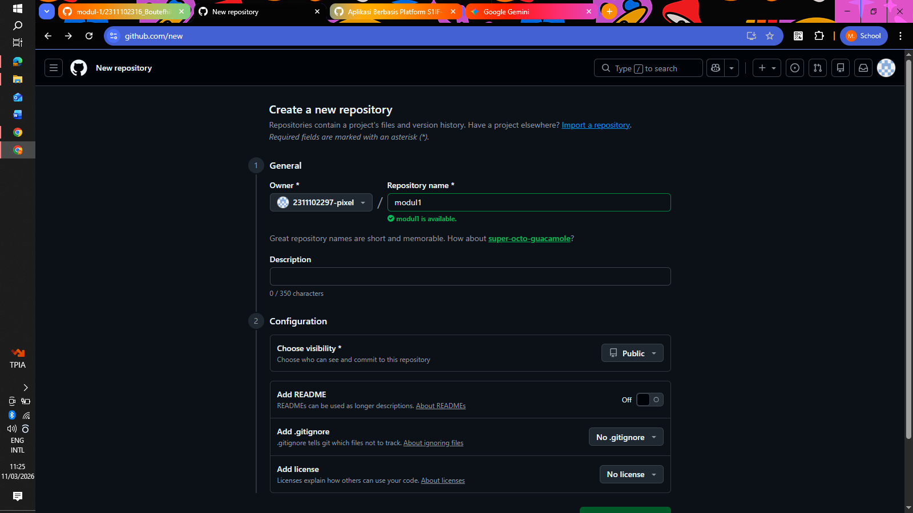
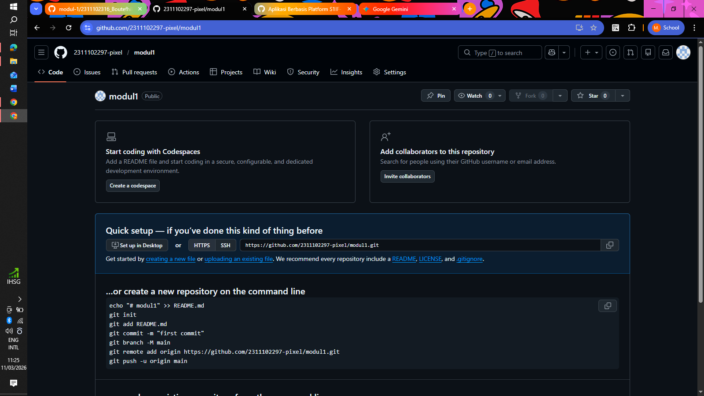
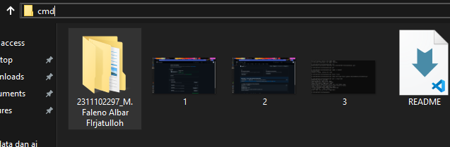
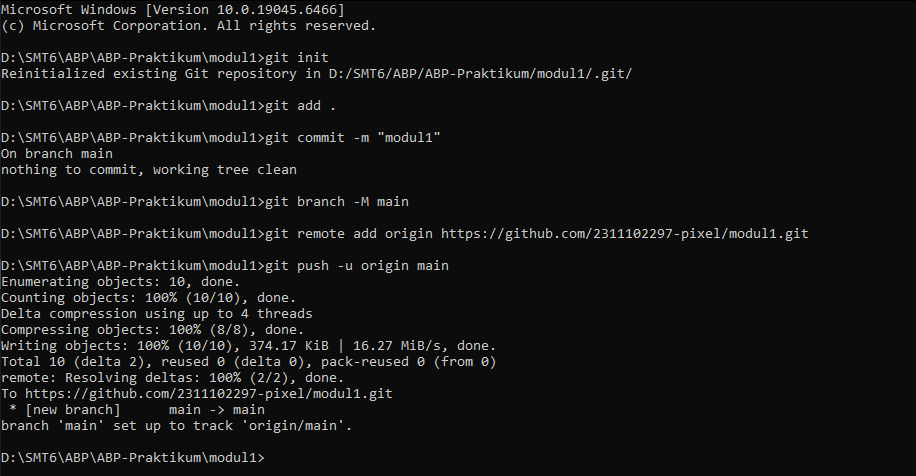
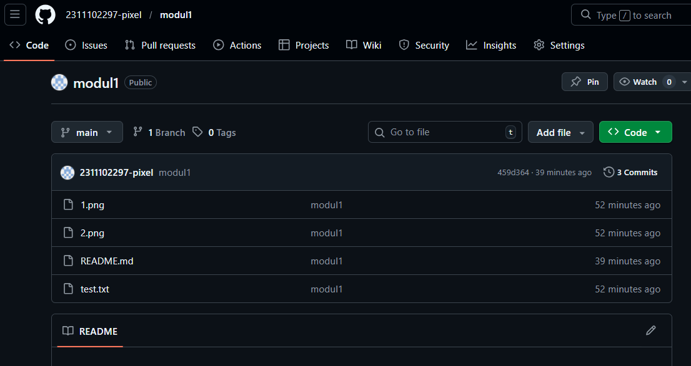

   
  <h1>LAPORAN PRAKTIKUM  PENGEMBANGAN APLIKASI BERBASIS PLATFORM</h1>
   
  <h3>MODUL 1   VERSION CONTROL SYSTEM: GIT</h3>
   
   
   
   
   
  <h3>Penyusun :</h3>
  

    <strong>M. Faleno Albar Firjatulloh</strong> 
    <strong>2311102297</strong> 
    <strong>S1 IF-11-01</strong>
  

   
  <h3>Dosen Pengampu :</h3>
  

    <strong>Dimas Fanny Hebrasianto Permadi, S.ST., M.Kom</strong>
  

   
   
    <h4>Tim Asisten Praktikum :</h4>
    <strong> Apri Pandu Wicaksono </strong>  
    <strong>Rangga Pradarrell Fathi</strong>
   
  <h3>LABORATORIUM HIGH PERFORMANCE
  FAKULTAS INFORMATIKA  UNIVERSITAS TELKOM PURWOKERTO  2026</h3>

---

## 1. Landasan Teori

**Git** merupakan sistem pengontrol versi (*Version Control System*) bersifat terdistribusi yang krusial bagi pengembang dalam memantau setiap perubahan pada kode sumber serta memfasilitasi kolaborasi tim yang efisien. Di sisi lain, **GitHub** berperan sebagai platform berbasis cloud yang menyediakan layanan hosting bagi repositori Git, sehingga proyek dapat tersimpan secara daring dan mudah diakses.

**Command Line Interface (CLI)** adalah mekanisme interaksi dengan sistem operasi melalui input teks. Dalam praktikum ini, penggunaan CLI (seperti Terminal atau CMD) memungkinkan eksekusi perintah Git secara lebih presisi, cepat, dan efektif dibandingkan menggunakan antarmuka grafis.

---

## 2. Konfigurasi Repositori melalui CLI

Di bawah ini adalah rangkaian prosedur untuk menginisialisasi dan menghubungkan repositori lokal ke platform GitHub menggunakan baris perintah:

### Tahap 1: Pembuatan Repositori Daring di GitHub

Langkah pertama melibatkan pembuatan wadah proyek baru (repositori) pada akun GitHub. Hal ini dilakukan agar seluruh progres pengerjaan kode memiliki salinan cadangan yang tersentralisasi secara daring.

### Tahap 2: Instruksi Konfigurasi Git

Setelah repositori daring siap, sistem akan menyajikan daftar perintah Git. Instruksi ini menjadi panduan utama untuk menyinkronkan data antara perangkat komputer lokal dengan server GitHub.

### Tahap 3: Persiapan Direktori Proyek dan Berkas

Pada fase ini, pengembang menyiapkan folder khusus di penyimpanan lokal yang berisi file-file proyek yang nantinya akan dikelola menggunakan sistem pengontrol versi.

### Tahap 4: Akses Terminal pada Lokasi Proyek

Buka jendela Command Prompt (CMD) atau Terminal, lalu arahkan navigasi ke folder proyek yang telah dibuat. Memastikan posisi direktori sudah tepat sangat penting agar perintah Git bekerja pada target folder yang diinginkan.

### Tahap 5: Eksekusi Perintah Push ke GitHub

Jalankan rangkaian perintah sesuai panduan: diawali dengan `git init` untuk inisialisasi, `git add` untuk menandai perubahan file, dan `git commit` untuk merekam riwayat perubahan. Terakhir, hubungkan dengan alamat remote dan gunakan `git push` untuk mengirimkan seluruh data ke GitHub.

### Tahap 6: Verifikasi Hasil Pembaruan

Langkah terakhir adalah melakukan validasi melalui peramban web dengan mengunjungi halaman repositori GitHub. Pastikan seluruh file yang telah dikirim dari lokal sudah muncul dan terorganisir dengan benar di server.

## Referensi
- [Materi Modul 1](https://drive.google.com/file/d/1sAJR4AconN_aZjvLF-GTY0DM-e84pL63/view?usp=sharing)