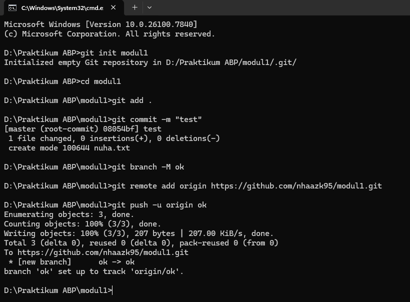
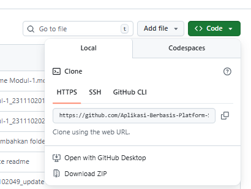

<div align="center">

<br>

<h1>
LAPORAN PRAKTIKUM <br>
APLIKASI BERBASIS PLATFORM
</h1>

<br>

<h3>
MODUL 1 <br>
GIT
</h3>

<br>


<br><br><br>

<h3>Disusun Oleh :</h3>

<strong>Boutefhika Nuha Ziyadatul Khair</strong><br>
<strong>2311102316</strong><br>
<strong>S1 IF-11-01</strong>

<br><br>

<h3>Dosen Pengampu :</h3>

<strong>Dimas Fanny Hebrasianto Permadi, S.ST., M.Kom</strong>

<br><br>

<h4>Asisten Praktikum :</h4>

Apri Pandu Wicaksono <br>
Rangga Pradarrell Fathi

<br><br>

<h3>
LABORATORIUM HIGH PERFORMANCE <br>
FAKULTAS INFORMATIKA <br>
UNIVERSITAS TELKOM PURWOKERTO <br>
2026
</h3>

</div>

<hr>


# Dasar Teori

## 2.1 Pengenalan Git
Git adalah salah satu sistem pengontrol versi (Version Control System) pada proyek perangkat lunak yang diciptakan oleh Linus Torvalds. Pengontrol versi bertugas mencatat setiap perubahan pada file proyek yang dikerjakan oleh banyak orang maupun sendiri. Git dikenal juga dengan distributed revision control (VCS terdistribusi), artinya penyimpanan database Git tidak hanya berada dalam satu tempat saja.

## 2.2 Instalasi Git
Setelah instalasi Git selesai, lakukan pengecekan dengan membuka Command Prompt dan mengetikkan perintah git --version. Perintah ini digunakan untuk memastikan bahwa Git telah berhasil terpasang pada PC atau laptop.


## 2.3 Penggunaan Git
### 2.3.1 Membuat repository
- Buka Github.com  
- Buat dan isi detail repository yang akan dibuat
  
- Klik **Create Repository**
- Jika sudah, akan muncul langkah-langkah untuk membuat repository dengan CMD
- Ikuti langkah-langkah seperti berikut
  
- Kode program
  
```
//2311102316
//Boutefhika Nuha Ziyadatul Khair

D:\Praktikum ABP>git init modul1
Initialized empty Git repository in D:/Praktikum ABP/modul1/.git/

D:\Praktikum ABP>cd modul1

D:\Praktikum ABP\modul1>git add .

D:\Praktikum ABP\modul1>git commit -m "test"
[master (root-commit) 08054bf] test
 1 file changed, 0 insertions(+), 0 deletions(-)
 create mode 100644 nuha.txt

D:\Praktikum ABP\modul1>git branch -M ok

D:\Praktikum ABP\modul1>git remote add origin https://github.com/nhaazk95/modul1.git

D:\Praktikum ABP\modul1>git push -u origin ok
Enumerating objects: 3, done.
Counting objects: 100% (3/3), done.
Writing objects: 100% (3/3), 207 bytes | 207.00 KiB/s, done.
Total 3 (delta 0), reused 0 (delta 0), pack-reused 0 (from 0)
To https://github.com/nhaazk95/modul1.git
 * [new branch]      ok -> ok
branch 'ok' set up to track 'origin/ok'.

D:\Praktikum ABP\modul1>
```

- Jika sudah, refresh halaman Github dan repository berhasil dibuat

### 2.3.2 Clone Repository milik orang lain
Untuk dapat bekerja sama dengan orang lain, kita dapat melakukan cloning repositori orang lain, berikut ini caranya:

- Buka repositori yang akan di-clone pada Github, lalu klik tombol clone. Copy text yang muncul seperti dibawah ini, ini merupakan url dari repositori tujuan yang akan di clone.

   
- Buka command prompt dan ketikan perintah ini
  
  
# UNGUIDED 
Melakukan setup repository via CLI
Untuk langkah - langkahnya ada dibagian dasar teori Pembuatan Git. Hasil setup repository via CLI:

